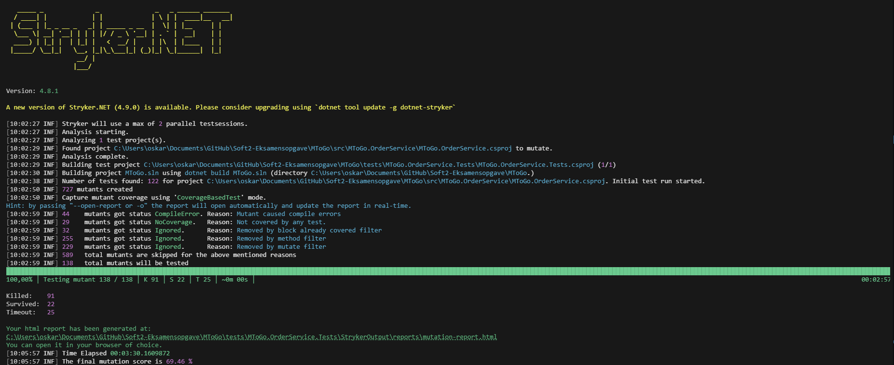
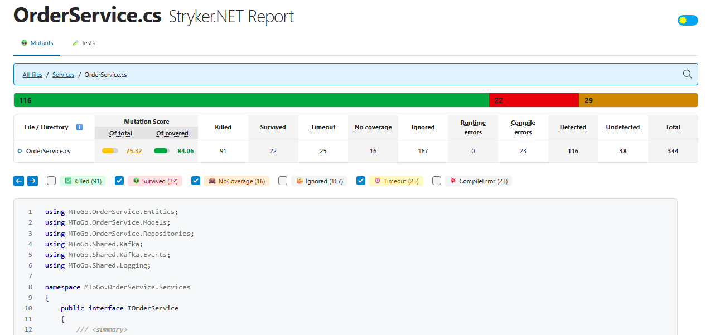
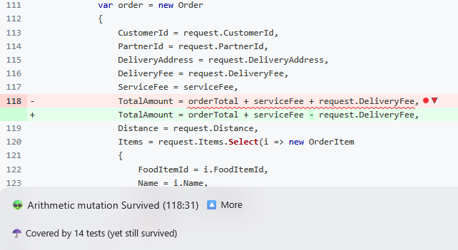
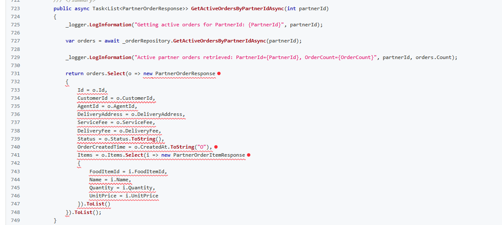
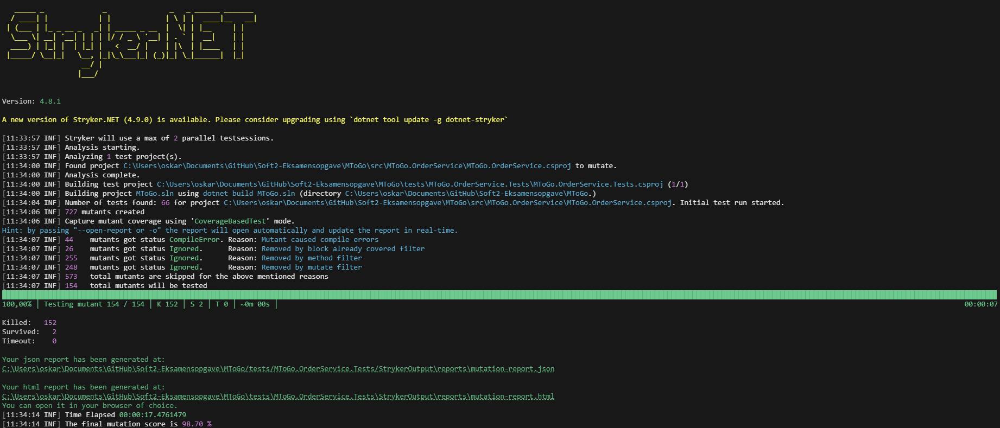

## Mutation Testing

### Overview
Mutation testing was performed using Stryker.NET to evaluate the effectiveness of the unit tests in the MToGo.OrderService project.   
The goal was to identify weaknesses in the test suite by introducing small changes (mutations) to the code and checking if the tests could detect these changes.

#### How to Run Mutation Testing

First make sure you have Stryker.NET installed, by using the following command:

```bash
dotnet tool restore
```

Then, you should have Stryker.NET available as a local tool. To run mutation testing, navigate to the `MToGo.OrderService.Tests` directory and execute the following command from project root:

```bash
dotnet stryker --config-file "MToGo/tests/MToGo.OrderService.Tests/stryker-config.json" --output "MToGo/tests/MToGo.OrderService.Tests/StrykerOutput" --verbosity info
```

#### Stryker Configuration
The mutation testing was configured using the following [`stryker-config.json`](./stryker-config.json) file located in the `MToGo.OrderService.Tests` directory.

### Mutation Testing Run

#### Initial Run
Each mutation testing run results in a report located in `mutation-report.html` within the `MToGo.OrderService.Tests` project directory.  
Note this auto makes .gitignore exclude the `StrykerOutput/` folder, so the report won't be committed to the repository. Therefore, we provide screenshots of the results below.

The first mutation testing run produced the following results:


When looking at the report `mutation-report.html`, we can see that several mutants were not killed:


This page displays several surviving mutants, indicating that the existing unit tests did not cover these scenarios effectively.

For example:






#### Fixing Issues
The second mutation testing run after fixing the issues produced the following results:


The final mutation testing report `mutation-report.html`, shows that all mutants were killed:


The previous examples of surviving mutants are now killed:


As an example, have we add more test e.g for the method GetActiveOrdersByPartnerIdAsync, where we previously had surviving mutants. The new test is as follows:
```csharp
[Fact]
public async Task GetActiveOrdersByPartnerIdAsync_ShouldReturnMappedOrdersAndItems()
{
    // Arrange
    var createdAt = new DateTime(2025, 12, 19, 2, 3, 4, DateTimeKind.Utc);
    var order = CreateOrder(OrderStatus.Accepted);
    order.Id = 88;
    order.PartnerId = 10;
    order.CustomerId = 11;
    order.AgentId = 12;
    order.DeliveryAddress = "PartnerDelivery";
    order.CreatedAt = createdAt;
    order.Items = new List<OrderItem>
    {
        new() { FoodItemId = 3, Name = "Salad", Quantity = 4, UnitPrice = 25m }
    };

    _mockRepository.Setup(r => r.GetActiveOrdersByPartnerIdAsync(10))
        .ReturnsAsync(new List<Order> { order });

    // Act
    var result = await _orderService.GetActiveOrdersByPartnerIdAsync(10);

    // Assert
    result.Should().HaveCount(1);
    result[0].Id.Should().Be(88);
    result[0].CustomerId.Should().Be(11);
    result[0].AgentId.Should().Be(12);
    result[0].DeliveryAddress.Should().Be("PartnerDelivery");
    result[0].OrderCreatedTime.Should().Be(createdAt.ToString("O"));
    result[0].OrderCreatedTime.Should().EndWith("Z");
    result[0].Items.Should().HaveCount(1);
    result[0].Items[0].FoodItemId.Should().Be(3);
    result[0].Items[0].Name.Should().Be("Salad");
    result[0].Items[0].Quantity.Should().Be(4);
    result[0].Items[0].UnitPrice.Should().Be(25m);
}
```