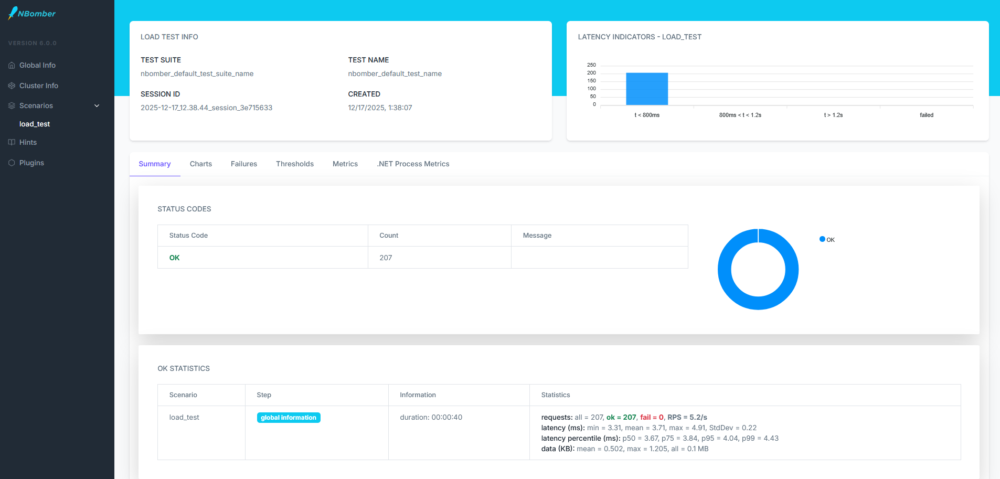
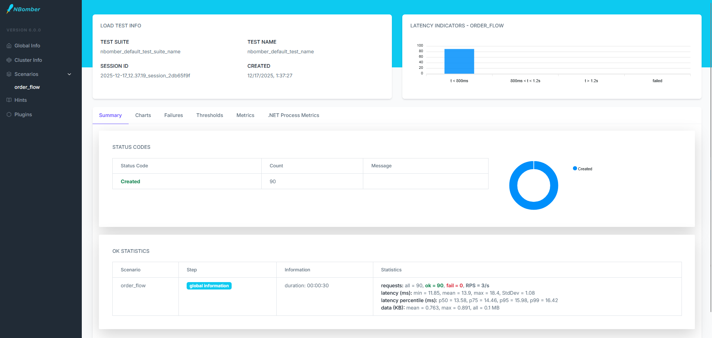
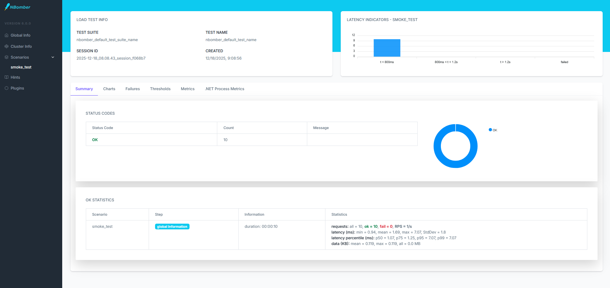
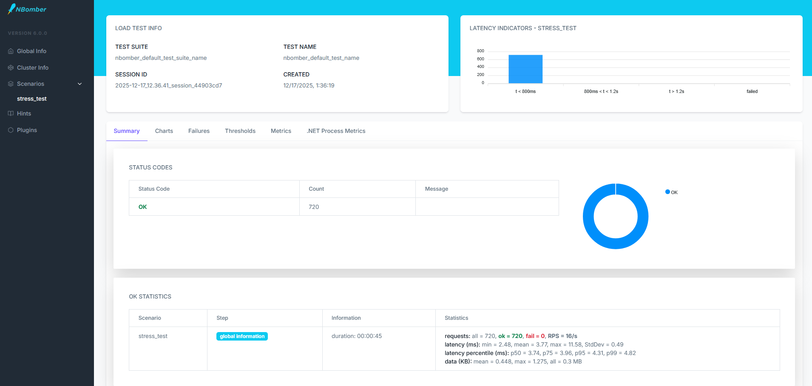

# MToGo Performance Tests

Performance testing using **NBomber** - a .NET load testing library.

## Quick Start

```bash
# 1. Start the full system (all services + gateway)
docker-compose up -d

# 2. Wait for services to be healthy
# Check http://localhost:8080/health

# 3. Run performance tests
cd MToGo/tests/MToGo.Performance.Tests
dotnet test -e RUN_PERFORMANCE_TESTS=true
```

**Note**: Tests hit real API endpoints, so the full MToGo system must be running. Tests are skipped by default so normal `dotnet test` won't run them.

## Test Types

| Test | What it does | Load | Endpoint |
|------|--------------|------|----------|
| **Smoke** | Check system is alive | 1 req/s for 10s | `/health` |
| **Load** | Normal peak read traffic | 6 req/s for 40s (with 10s ramp-up) | `/api/v1/orders/customer/{id}` |
| **Stress** | Find read breaking point | 6 → 12 → 30 req/s | `/api/v1/orders/customer/{id}` |
| **OrderFlow** | Create orders (with auth) | 3 req/s for 30s | `/api/v1/orders/order` |

## Realistic Traffic Simulation

All tests use **randomized users and data** to simulate real-world usage:

- **Random customer IDs** (1-999) prevent database query caching
- **Varied order payloads** with random items, quantities, and prices
- **Different addresses/fees** for each request
- **No caching effects** - each request is unique like real user traffic

This ensures accurate performance measurements that reflect production behavior.

## Traffic Calculation (Simple Queueing Theory)

We calculate test load based on business requirements:

```
Business target: 18,000,000 orders/year
Daily average:   18,000,000 / 365 = 49,315 orders/day
Peak hours:      7 hours (lunch + dinner)
Peak multiplier: 3x

Peak RPS = (49,315 × 3) / (7 × 3600) ≈ 6 requests/second
```

### Key Concepts

**Utilization** = Arrival Rate / Service Rate

```
0-50%   → System is relaxed
50-70%  → Normal operation
70-85%  → Heavy load
85%+    → Danger! Response times explode
```

This is why we test at 6 req/s - it's our calculated peak load.

## Running Tests

```bash
# Normal test run (skips performance tests)
dotnet test

# Run performance tests
dotnet test -e RUN_PERFORMANCE_TESTS=true

# Run specific test
dotnet test -e RUN_PERFORMANCE_TESTS=true --filter "SmokeTest"
```

## Reports

NBomber generates HTML reports in `bin/Debug/net8.0/reports/` folder:
- `smoke/` - Basic connectivity check
- `load/` - Read API performance under normal load
- `stress/` - Read API performance under stress (finds breaking points)
- `order-flow/` - Write API performance (order creation)

Open `index.html` in any folder to see graphs and stats. Reports now show realistic performance data from actual API calls with randomized traffic patterns.

## Example Reports

Since the `bin/Debug/net8.0/reports/` folder is generated at runtime and not committed to Git, here are examples of the actual reports generated by our performance tests:

### Report Structure 

[reports/](./reports/)  # (Copied from bin/Debug/net8.0/reports/)  
├── load/  
│   ├── [index.html](./reports/load/index.html)     # Interactive dashboard  
│   ├── [statistics.csv](./reports/load/statistics.csv) # Raw performance data  
│   ├── [statistics.md](./reports/load/statistics.md)  # Markdown summary  
│   ├── [statistics.txt](./reports/load/statistics.txt) # Text summary  
│   └── [nbomber-load-test-log.txt](./reports/load/nbomber-load-test-log.txt)  
├── order-flow/  
│   ├── [index.html](./reports/order-flow/index.html)  
│   ├── [statistics.csv](./reports/order-flow/statistics.csv)  
│   └── [statistics.md](./reports/order-flow/statistics.md)  
│   └── [statistics.txt](./reports/order-flow/statistics.txt)  
│   └── [nbomber-order-flow-test-log.txt](./reports/order-flow/nbomber-order-flow-test-log.txt)  
├── smoke/  
│   ├── [index.html](./reports/smoke/index.html)  
│   ├── [statistics.csv](./reports/smoke/statistics.csv)  
│   └── [statistics.md](./reports/smoke/statistics.md)  
│   └── [statistics.txt](./reports/smoke/statistics.txt)  
│   └── [nbomber-smoke-test-log.txt](./reports/smoke/nbomber-smoke-test-log.txt)  
└── stress/  
    ├── [index.html](./reports/stress/index.html)  
    ├── [statistics.csv](./reports/stress/statistics.csv)  
    └── [statistics.md](./reports/stress/statistics.md)  
    └── [statistics.txt](./reports/stress/statistics.txt)  
    └── [nbomber-stress-test-log.txt](./reports/stress/nbomber-stress-test-log.txt)  


#### Load .html Example


#### Order Flow .html Example


#### Smoke .html Example


#### Stress .html Example



## Project Structure

```
MToGo.Performance.Tests/
├── PerformanceTests.cs       # All tests + traffic calculations + JWT token generation
├── README.md
└── bin/Debug/net8.0/reports/ # Generated HTML reports (after running tests)
```

**Key Features:**
- Uses shared JWT service for consistent token generation
- Randomized users/data to prevent caching effects
- Real API endpoints for accurate performance measurements
- Queueing theory calculations for scientifically-grounded load testing
