# Deployment evidence / screenshots

Dette dokument samler beviser (screenshots) for, at løsningen kører i flere miljøer. For at gøre det nemt at sammenligne, er screenshots grupperet efter **type** (Website, API, Grafana, osv.) i stedet for efter miljø.

Disse miljø-labels kan bruges til billederne:

- **Docker Compose (lokal)**
- **Terraform local (lokal Kubernetes)**
- **Azure (AKS + Azure Managed Grafana)**

## A) Applikation (Website/API)

### A.1 Website

Formål: Vise at UI'et loader og at platformen er tilgængelig for slutbrugere.

- Miljø: Docker Compose (lokal)
- URL: http://localhost:8081

- Miljø: Terraform local (lokal Kubernetes)
- URL: https://localhost/
- Forventning: Ingress route `/` går til website-service.

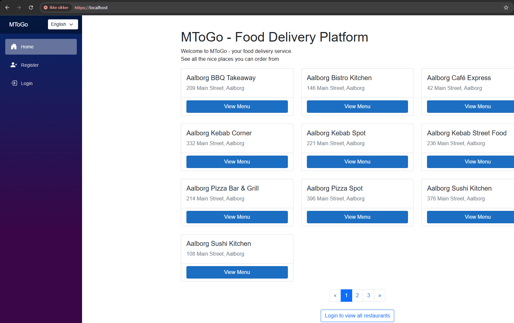

- Miljø: Azure (AKS)
- URL: https://ingress-ip/
- Forventning: Ingress i AKS router `/` til website-service.

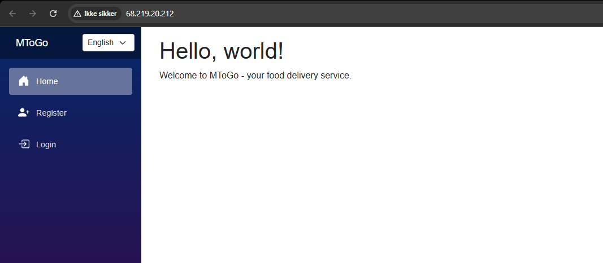

### A.2 API Gateway

Formål: Vise at gateway'en kører og kan nås.

- Miljø: Docker Compose (lokal)
- URL: http://localhost:8080

## B) Observability (Prometheus/Grafana/Alerting)

### B.1 Prometheus

Formål: Dokumentere at metrics-scraping fungerer, og at alert rules er loaded.

- Miljø: Docker Compose (lokal)
- URL: http://localhost:9090
- Forventning: Targets er "UP", og rules/alerts er loaded.

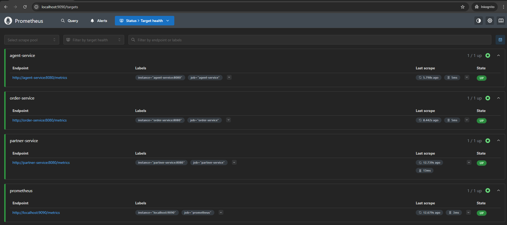

Kontekst: Dette screenshot viser typisk Prometheus Targets (eller tilsvarende), hvor services fremstår som "UP".

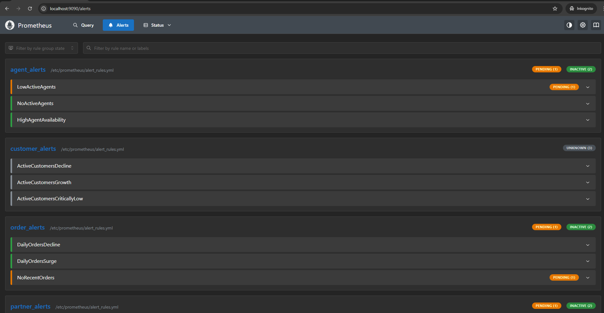

Kontekst: Dette screenshot viser typisk Rules/Alerts (fx `business_kpi` regler), så man kan se at alert rules er indlæst.

### B.2 Grafana (KPI)

Formål: Vise KPI dashboards samt at datasource/alerting er sat op.

- Miljø: Docker Compose (lokal)
- URL: http://localhost:3000
- Forventning: KPI dashboard loader, alerts/rules er synlige, og datasource peger på Prometheus.

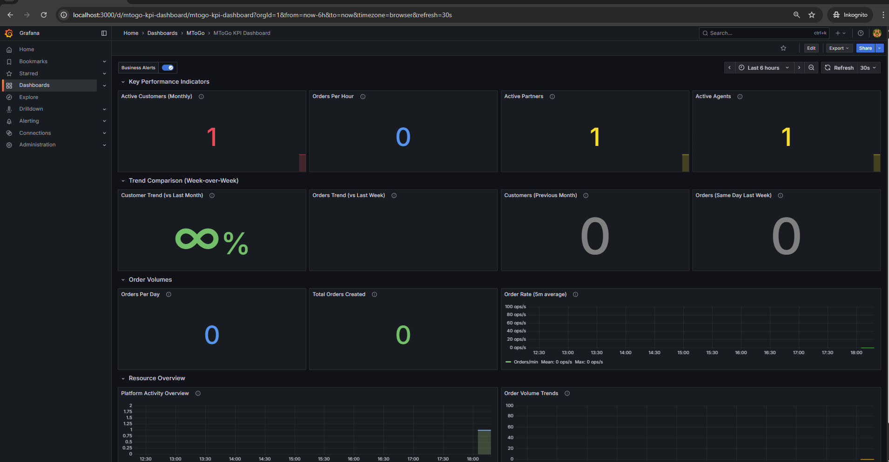

Kontekst: KPI dashboard (forretnings-KPI’er) er synligt og opdaterer via Prometheus datasource.

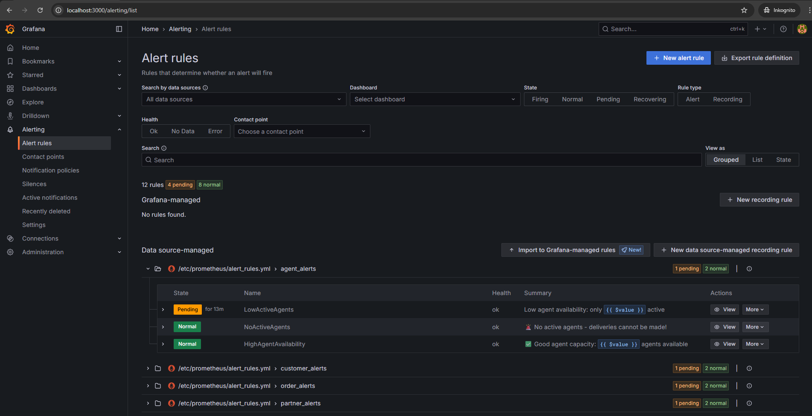

Kontekst: Alerting/Rules (eller tilsvarende) viser at KPI alert rules er tilgængelige i Grafana.

Kontekst: Datasources (fx Prometheus/Alertmanager) er konfigureret korrekt.

- Miljø: Azure (Azure Managed Grafana - KPI)
- Endpoint: fra Terraform output `kpi_grafana_endpoint`

Kontekst: KPI dashboards er provisioneret/synkroniseret til Azure Managed Grafana.

Kontekst: KPI Grafana alerting/rules eller kontaktpunkt (Discord) er sat op (afhænger af hvad billedet viser).

### B.3 Grafana (SLO)

Formål: Vise SLO/infra dashboards (adskilt fra KPI dashboards).

- Miljø: Docker Compose (lokal)
- URL: http://localhost:3001

- Miljø: Azure (Azure Managed Grafana – SLO)
- Endpoint: fra Terraform output `slo_grafana_endpoint`

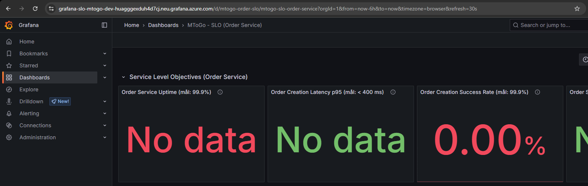

Kontekst: SLO dashboards er provisioneret/synkroniseret separat fra KPI Grafana.

### B.4 Alerting / Discord

Formål: Dokumentere at alerts kan leveres som notifikationer (Discord) og/eller at alerting UI viser aktive alerts.

- Miljø: Docker Compose (lokal)

Kontekst: Discord-notifikation (firing/resolved) som viser at Alertmanager webhook routing virker.

## C) Infrastruktur og deployment-beviser (Terraform/AKS/GitHub)

### C.1 Terraform deploy output (local Kubernetes)

Formål: Vise at `deploy.ps1` har deployet succesfuldt og udskriver endpoints/outputs.

- Miljø: Terraform local (lokal Kubernetes)
- Kommando: `./terraform/deploy.ps1 -Context local -Build`

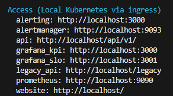

### C.2 Kubernetes status (local Kubernetes)

Formål: Vise at workloads er "Running/Ready", og at services/ingress er oprettet.

- Miljø: Terraform local (lokal Kubernetes)

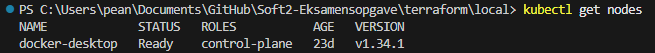

Kontekst: `kubectl get nodes` (viser at cluster er tilgængelig).

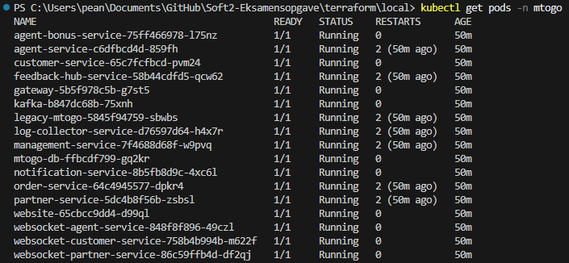

Kontekst: `kubectl get pods -n mtogo` (viser services i gang).

Kontekst: `kubectl get svc -n mtogo` (viser services og porte).

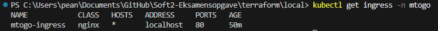

Kontekst: `kubectl get ingress -n mtogo`.

### C.3 Monitoring eksponering i local Kubernetes

Formål: Vise at monitoring-komponenter er deployet og kan tilgås via localhost-porte.

- Miljø: Terraform local (lokal Kubernetes)

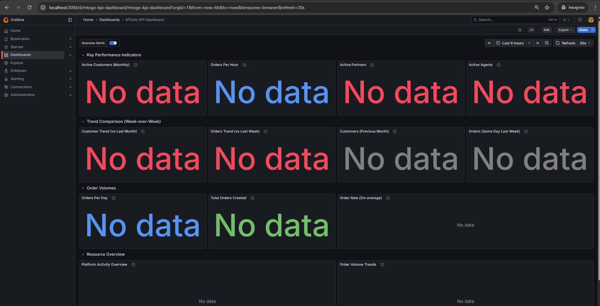

Kontekst: Grafana/Prometheus/Alertmanager endpoints er tilgængelige.

Kontekst: Ekstra bevis for at monitoring kører.

### C.4 Terraform deploy output (Azure)

Formål: Vise at Azure-deploy via `deploy.ps1` kører, og at outputs (Grafana endpoints, ingress IP, osv.) fremkommer.

- Miljø: Azure
- Kommando: `./terraform/deploy.ps1 -Context azure`

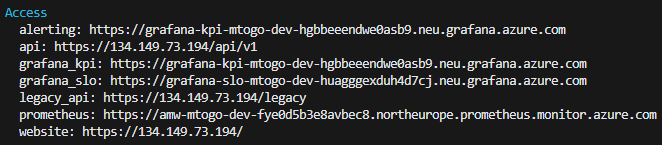

### C.5 Azure Portal (resource group)

Formål: Vise at Azure-ressourcerne faktisk er provisioneret (AKS, Postgres, Grafana, Monitor Workspace).

- Miljø: Azure
- Resource Group: `rg-mtogo-<env>`

### C.6 GitHub Actions

Formål: Vise at CI/CD workflows kører og giver en grøn deploy/test.

- Workflow: `.github/workflows/azure_deploy.yml`

- Workflow: `.github/workflows/azure_staging_test.yml`
