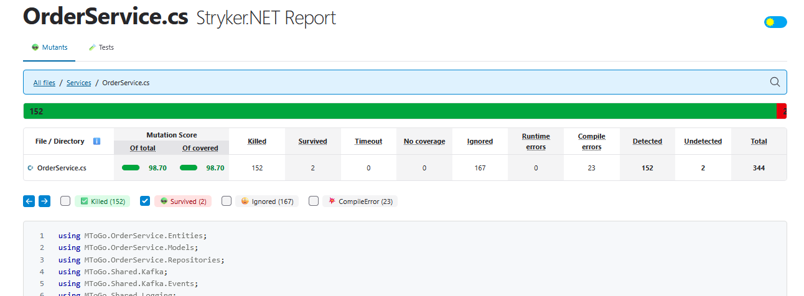
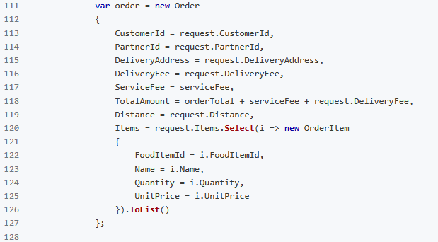
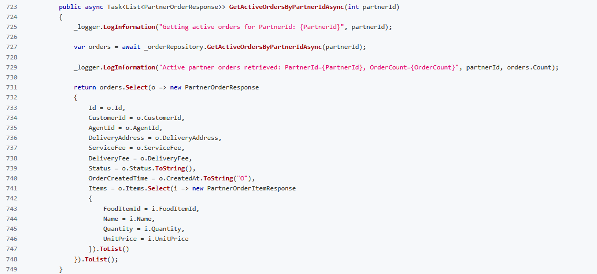

# Mutation Testing

## Overblik

Mutation testing blev udført med **Stryker.NET** for at evaluere effektiviteten af unit tests i MToGo.OrderService.  
Målet var at identificere svagheder i test-suiten ved at introducere små ændringer (mutationer) i koden og derefter kontrollere, om testene kunne opdage disse ændringer.

### Sådan kører du Mutation Testing

Sørg først for, at du har Stryker.NET installeret ved at køre følgende kommando:

```bash
dotnet tool restore
```

Herefter bør Stryker.NET være tilgængelig som et lokalt værktøj. For at køre mutation testing, gå til `MToGo.OrderService.Tests`-mappen og kør følgende kommando fra projektets rod:

```bash
dotnet stryker --config-file "MToGo/tests/MToGo.OrderService.Tests/stryker-config.json" --output "MToGo/tests/MToGo.OrderService.Tests/StrykerOutput" --verbosity info
```

### Stryker-konfiguration

Mutation testing er konfigureret via følgende fil [`stryker-config.json`](../../MToGo/tests/MToGo.OrderService.Tests/stryker-config.json), som ligger i `MToGo.OrderService.Tests`-mappen.

## Kørsel af Mutation Testing

### Første kørsel

Hver mutation testing-kørsel genererer en rapport i `mutation-report.html` i projektmappen for `MToGo.OrderService.Tests`.  
Bemærk at dette automatisk får .gitignore til at udelukke mappen `StrykerOutput/`, så rapporten ikke bliver committed til repository'et. Derfor vedlægger vi screenshots af resultaterne nedenfor.

Første mutation testing-kørsel gav følgende resultater:


Når vi ser på rapporten `mutation-report.html`, kan vi se at flere mutanter ikke blev "killed":


Denne side viser flere overlevende mutanter, hvilket indikerer at de eksisterende unit tests ikke dækkede disse scenarier tilstrækkeligt.

For eksempel:


### Rettelser af problemer

Den anden mutation testing-kørsel, efter at problemerne var rettet, gav følgende resultater:


Den endelige mutation testing-rapport `mutation-report.html` viser, at alle mutanter blev "killed":


De tidligere eksempler på overlevende mutanter er nu "killed":  




Som eksempel har vi tilføjet flere tests, fx for metoden GetActiveOrdersByPartnerIdAsync, hvor vi tidligere havde overlevende mutanter. Den nye test ser sådan ud:

```csharp
[Fact]
public async Task GetActiveOrdersByPartnerIdAsync_ShouldReturnMappedOrdersAndItems()
{
    // Arrange
    var createdAt = new DateTime(2025, 12, 19, 2, 3, 4, DateTimeKind.Utc);
    var order = CreateOrder(OrderStatus.Accepted);
    order.Id = 88;
    order.PartnerId = 10;
    order.CustomerId = 11;
    order.AgentId = 12;
    order.DeliveryAddress = "PartnerDelivery";
    order.CreatedAt = createdAt;
    order.Items = new List<OrderItem>
    {
        new() { FoodItemId = 3, Name = "Salad", Quantity = 4, UnitPrice = 25m }
    };

    _mockRepository.Setup(r => r.GetActiveOrdersByPartnerIdAsync(10))
        .ReturnsAsync(new List<Order> { order });

    // Act
    var result = await _orderService.GetActiveOrdersByPartnerIdAsync(10);

    // Assert
    result.Should().HaveCount(1);
    result[0].Id.Should().Be(88);
    result[0].CustomerId.Should().Be(11);
    result[0].AgentId.Should().Be(12);
    result[0].DeliveryAddress.Should().Be("PartnerDelivery");
    result[0].OrderCreatedTime.Should().Be(createdAt.ToString("O"));
    result[0].OrderCreatedTime.Should().EndWith("Z");
    result[0].Items.Should().HaveCount(1);
    result[0].Items[0].FoodItemId.Should().Be(3);
    result[0].Items[0].Name.Should().Be("Salad");
    result[0].Items[0].Quantity.Should().Be(4);
    result[0].Items[0].UnitPrice.Should().Be(25m);
}
```
