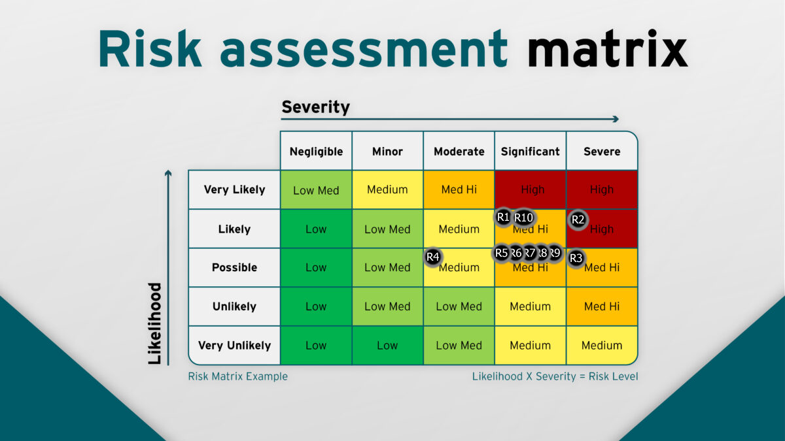

# **Teststrategi hos IT-konsulenthuset**

Version: 1.0  
Dato: 17. november 2025  
Forfattere: Oskar, Peter og Yusuf

## **Indholdsfortegnelse**

- [Indledning](#indledning)
- [Mål](#mål)
- [Roller og ansvar](#roller-og-ansvar)
- [Teststandarder](#teststandarder)
- [Test Governance](#test-governance)
- [Scope](#scope)
- [Risikoanalyse](#risikoanalyse)

## **Indledning**

Denne teststrategi giver et højt niveau overblik over test tilgangen til IT-konsulenthusets projekter.

IT-konsulenthusets primære fokus er på Service-Oriented Architecture (SOA), hvor forretningsfunktioner leveres som uafhængige services.

## **Mål**

- Projekter er løst koblede, men kan samkøres efter behov.
- Opsætningsdokumentation er klar og forståelig for kunden.
- Exit-kriterier aftales med kunden for at sikre leveringsstandard.
- Viden deles løbende, så ikke én person besidder al viden.
- Risici identificeres og dokumenteres via en risikoanalyse.

## **Roller og ansvar**

- **Udvikler:**
  - Udvikler funktionalitet i overensstemmelse med kravspecifikationen og acceptkriterier.
  - Skriver og vedligeholder unit- og integrationstests for at sikre kodekvalitet.
  - Udarbejder end-to-end tests i samarbejde med Designer for at validere brugerflows.
  - Udfører peer reviews med andre udviklere for at verificere kvalitet og relevans af unit- og integrationstests.
- **QA Manager/Test Lead:**
  - Udarbejder Teststrategi og Test Planer, inklusive omfang, ressourcer og tidsplan.
  - Sikrer dokumentation af testresultater, fejl og lektioner lært.
  - Holder løbende kontakt med Projektleder om test fremdrift, risici og blokeringer.
  - Validerer, at end-to-end tests dækker relevante scenarier korrekt.
  - Overvåger og sikrer udførelse af testplaner, inklusive justeringer baseret på feedback.
- **Projektleder:**
  - Sikrer overholdelse af tidsplan, budget og ressourcer i testfasen.
  - Eskalerer kritiske risici, blokeringer og afvigelser til interessenter.
  - Godkender testplaner, security planer og ændringer heri.
  - Koordinerer tværgående aktiviteter mellem roller for at minimere forsinkelser.
- **Product Owner:**
  - Sikrer, at end-to-end tests er relevante og afstemt med forretningsbehovet.
  - Validerer testplaner mod funktionelle krav og use cases.
  - Prioriterer testområder baseret på forretningsværdi og risikoprofil.
  - Deltager aktivt i acceptance testing for at bekræfte leveret værdi.
- **DevOps:**
  - Opsætter generelle pipelines, herunder CI/CD, tilpasset projektets behov.
  - Etablerer testmiljøer og dedikerede CI/CD-pipelines for udvikling og test.
  - Skriver og vedligeholder performance tests for at måle systemets skalérbarhed.
  - Udfører performance tests og eskalerer resultater til Projektleder ved underpræstation.
- **Security Expert:**
  - Skriver og vedligeholder sikkerhedstests, inklusive vulnerability scanning og penetration testing.
  - Dokumenterer overholdelse af sikkerhedskriterier defineret i test planer, og eskalerer afvigelser til Projektleder.
  - Rådgiver om sikkerhedsrisici i testplaner og integrerer dem i overordnede tests.
- **Designer (UX):**
  - Designer end-to-end tests, der fokuserer på brugeroplevelse og usability-scenarier.
  - Forklarer og demonstrerer end-to-end tests til Udviklere for implementering.
  - Deltager i udførelse af end-to-end tests sammen med kunder eller brugere for feedback.
- **Arkitekt:**
  - Designer systemarkitektur i overensstemmelse med kravspecifikationen og acceptkriterier.
  - Validerer, at arkitekturen understøtter testbarhed, herunder modulær design og automatisering.
  - Rådgiver om tekniske risici i testfasen og foreslår arkitektoniske ændringer ved behov.
- **Stakeholder/Interessent (Kunde):**
  - Deltager i review af Test Planer for at sikre alignment med eksterne krav.
  - Bidrager med input til risikovurdering og prioritering af testområder.
  - Godkender endelige testresultater og acceptance criteria.
- **Compliance Officer:**
  - Overvåger overholdelse af lovgivning og branchenormer i alle testfaser.
  - Udfører audits af testdokumentation og resultater.
  - Eskalerer compliance-risici til Projektleder og Product Owner.

## **Teststandarder**

Alle projekter skal overholde nedenstående standarder, med mulighed for tilpasning og erstatning.

Test doubles anvendes til:

- mocks for interaktioner
- stubs for faste data
- dummies for irrelevante parametre

Tests skal fokusere på ét enkelt formål ad gangen. Det er tilladt at have flere assertions i samme test, så længe alle assertions verificerer den samme bekymring (for eksempel flere felter i en null-check). Forskellige scenarier eller concerns, såsom succes- og fejlsituationer, bør dækkes af separate tests.

Navngiv tests i overensstemmelse med det valgte programmeringssprog og testbiblioteks konventioner, så formålet med hver test er tydeligt. Organisér testkoden, så den er let at navigere og vedligeholde, og så det er enkelt at finde de tests, der hører til en given komponent eller service.

## **Test Governance**

### Filosofi

- Prioriter tidlig fejlfinding, robusthed og skalerbarhed via test orienterede udviklingsmetoder som defineret i test planer.
- Sikkerhedstest er en standard i alle projekter.
- Udnyt mutation testing i særtilfælde hvor der er kritisk logik for at undgå edge cases.

### Escalation Paths for Risici

- Lav-risici håndteres lokalt af udviklere
- Medium-risici eskaleres til QA Manager inden for 48 timer
- Høj-impact risici eskaleres øjeblikkeligt til projektleder

### Overvågning og Compliance

- Månedlige reviews af test deliverables som defineret i test planer
- Automatiserede CI-checks i DevOps for at flagge afvigelser og sikre standarder.

## **Scope**

Vi benytter Test Pyramiden som ramme for fordelingen af tests, da vi primært udvikler service-baserede arkitekturer med løst koblet integration mellem services. Derfor lægger vi ikke stor vægt på integrationstests. I stedet prioriteres unit tests, så de individuelle services kan kvalitetssikres effektivt.

_Image Source: [https://software-tester.io/understanding-the-test-pyramid/](https://software-tester.io/understanding-the-test-pyramid/)_

De testtyper, der anvendes i vores projekter, samt definitionen af teststørrelserne, fastlægges i de enkelte testplaner:

- Unit-tests
- Integrationstest
- System test
- End-to-end test
- Acceptance test
- Specifikationsbaserede tests
- Sikkerhedstests

## **Risikoanalyse**

Denne sektion identificerer strategiske parent-risici (R1-R10), der er relevante på tværs af IT-konsulenthusets projekter. Risici er organiseret i én samlet tabel for at give et helhedsbillede af organisationens risikoprofil.

**Struktur og anvendelse:**

1. **Parent-risici (R1-R10)**: Defineret herunder som strategiske umbrella-risici.
2. **Shared sub-risici (R1.1, R1.2, etc.)**: Detaljerede fælles risici defineret i et dokument for hver produkt.
3. **Service-specifikke sub-risici**: Unikke risici for hver service, defineret i test planer med fortsættende nummerering.

_Vi har tilføjet R1-10 til det originale billede. Model over de strategiske risici og deres sandsynlighed/betydning. Image Source: [https://www.riskpal.com/risk-assessment-matrices/](https://www.riskpal.com/risk-assessment-matrices/)_

Denne model er baseret på nedenstående risici og er lavet for at give oversigt over hvor alvorlige vores dokumenterede risici er. Heraf skal der yderligere laves risiko analyse i hvert testplan for hver kategori seperat, hvor hvert punkt i denne strategi kan udfoldes til flere risici i en testplan.

| Risk ID | Kategori                 | Risk Description                                         | General Mitigation Approach                                                                                                    | Severity    | Likelihood |
| :------ | :----------------------- | :------------------------------------------------------- | :----------------------------------------------------------------------------------------------------------------------------- | :---------- | :--------- |
| R1      | Performance & Skalering  | System performance under forventet og uventet belastning | Implementer load testing, autoskalering, og performance monitoring; test under realistiske load scenarios                      | Significant | Likely     |
| R2      | Sikkerhed & Compliance   | Sikkerhedstrusler mod data og systemadgang               | Anvend sikker kodning (parameterized queries, input validation); kør OWASP-checks; implementer authentication og authorization | Severe      | Likely     |
| R3      | Sikkerhed & Compliance   | Compliance og data privacy violations                    | Implementer encryption (in transit og at rest); dokumentér compliance; sikr audit trails og data lifecycle management          | Severe      | Possible   |
| R4      | Team & Ressource         | Team kontinuitet og ressourcetilgængelighed              | Implementer cross-training og backup-roller; dokumentér viden; brug succession planning og knowledge sharing                   | Moderate    | Possible   |
| R5      | Udvikling & Kvalitet     | Testdækning og kvalitetssikring utilstrækkelig           | Sæt coverage goals; automatiser tests i CI/CD; anvend code reviews og static analysis                                          | Significant | Possible   |
| R6      | Infrastruktur & Miljø    | Test- og produktionsmiljø problemer                      | Automatiser miljøopsætning; sikr miljøer matcher produktion; implementer monitoring og redundans                               | Significant | Possible   |
| R7      | Infrastruktur & Miljø    | Eksterne afhængigheder og integrationer                  | Brug mocks/stubs i tests; implementer fallback mekanismer; test integration failures; monitor tredjeparts services             | Significant | Possible   |
| R8      | Integration & Deployment | Deployment og release failures                           | Test i staging; inkluder smoke tests post-deploy; implementer rollback procedures                                              | Significant | Possible   |
| R9      | Integration & Deployment | Regression og dataintegritet efter changes               | Kør fuld regression suite efter ændringer; test migrations grundigt; implementer automated rollback; validér data integrity    | Significant | Possible   |
| R10     | Udvikling & Kvalitet     | Krav og funktionalitet misalignment                      | Involver QA og Product Owner tidligt; validér via acceptance tests; sikr traceability mellem krav og tests                     | Significant | Likely     |
