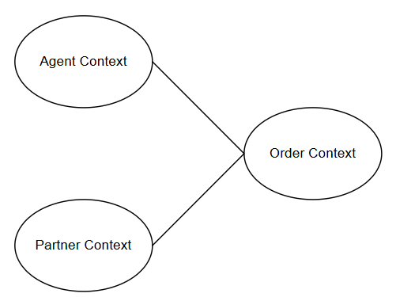

# Bounded Contexts

Dette dokument definerer de tre primære Bounded Contexts i MToGo systemet. Hver kontekst er indkapslet med sit eget ansvar, ubiquitous language, domain events og præcis ét aggregate.

### Context Map

Vores tre Bounded Contexts hænger sammen som følger:

- Order Context refererer til Partner og Agent Contexts for at hente nødvendige oplysninger om Partnere og Agenter.
- Partner Context og Agent Context er uafhængige og kommunikerer ikke direkte med hinanden.

---

## 1. Order Context

**Beskrivelse:**
Order Context er kernen i systemet. Formålet er at styre hele workflowet for ordrer fra oprettelse til levering. Dette inkluderer betalingshåndtering, status tracking, notifikationer til kunden og indsamling af feedback efter levering.

**Ubiquitous Language:**
| Term | Description |
| --- | --- |
| **Order** | En Customers bestilling af mad fra en Partner. |
| **Customer** | En bruger, der benytter MToGo App til at bestille mad. |
| **Partner** | En restaurant eller madvirksomhed, der modtager ordrer og laver mad. |
| **Agent** | En leveringsbud, der henter og leverer ordrer. |
| **Service Fee** | En procentdel af ordren som Partner betaler til MToGo. |
| **Delivery Fee** | Det leveringsgebyr, en Customer betaler for deres Order. |
| **Order Status** | Den aktuelle tilstand af en Order, som kan være en af følgende: Placed, Accepted, Rejected, Prepared, PickedUp, Delivered. |
| **Payment Transaction** | Betalingsprocessen for en ordre via ekstern gateway. |
| **Notification** | SMS eller push-notifikation sendt til kunden ved statusændringer. |
| **Feedback Request** | Muligheden for at give reviews efter levering. |
| **Reviews** | Food Review, Agent Review og Order Review (1-5 stjerner). |

**Domain Events:**

- `OrderPlaced`: En Customer har placeret en ordre og betalingsprocessen starter.
- `PaymentSucceeded`: Betaling er gennemført succesfuldt (eksternt system).
- `PaymentFailed`: Betaling fejlede og ordre annulleres (eksternt system).
- `OrderAccepted`: Partner har godkendt ordren og starter madlavning.
- `OrderRejected`: Partner har afvist ordren (udløser refund).
- `AgentAssigned`: En Agent er blevet tildelt ordren.
- `OrderPrepared`: Maden er klar til afhentning.
- `OrderPickedUp`: Agent har hentet maden hos Partner.
- `OrderDelivered`: Agent har afleveret maden til Customer.
- `ReviewSubmitted`: Customer har indsendt feedback (Food, Agent, Overall).

**Aggregate:**

### OrderAggregate

**Root Entity: Order**

- **Fields:**
  - `OrderId` (unique identifier)
  - `OrderStatus` (enum: Placed, Accepted, Rejected, Prepared, PickedUp, Delivered)
  - `PlacedAt` (timestamp)
  - `TotalAmount` (Money value object)
  - `CustomerId` (reference til Customer i Order Context)
  - `PartnerId` (reference til Partner aggregate i Partner Context)
  - `AgentId` (reference til Agent aggregate i Agent Context - nullable indtil assigned)
  - `PaymentTransaction` (embedded entity)
  - `OrderItems` (list of OrderItem value objects)
  - `Reviews` (ReviewSet value object - nullable indtil submitted)
  - `Notifications` (list of Notification value objects)

**Entities:**

- **PaymentTransaction**
  - `TransactionId`
  - `Status` (enum: Pending, Succeeded, Failed, Refunded)
  - `Amount` (Money)
  - `ProcessedAt` (timestamp)
  - `ExternalReference` (Nets transaction ID)

**Value Objects:**

- **OrderItem**

  - `FoodItemId` (reference til Partner Context's menu)
  - `FoodItemName` (string)
  - `Quantity` (positive integer)
  - `UnitPrice` (Money)
  - `Subtotal` (Money)

- **Money**

  - `Amount` (decimal)
  - `Currency` (string: "DKK")

- **ReviewSet**

  - `FoodReview` (integer 1-5)
  - `AgentReview` (integer 1-5)
  - `OrderReview` (integer 1-5)
  - `SubmittedAt` (timestamp)

- **Notification**

  - `Type` (enum: SMS, PushNotification)
  - `Message` (string)
  - `SentAt` (timestamp)
  - `Status` (enum: Pending, Sent, Failed)

- **Address**
  - `Street` (string)
  - `City` (string)
  - `PostalCode` (string)
  - `Country` (string: "Denmark")

**Invariants:**

- Order kan kun accepteres hvis `OrderStatus = Placed` og `PaymentTransaction.Status = Succeeded`
- Agent kan kun assignes hvis `OrderStatus = Accepted` eller `OrderStatus = Prepared`
- Partnere kan kun modtage nye ordrer hvis partneren er `IsActive = true`
- Order kan kun afvises hvis `OrderStatus = Placed`
- Reviews kan kun submittes hvis `OrderStatus = Delivered`
- Alle ratings skal være heltal mellem 1 og 5 (inklusiv)
- `TotalAmount` skal matche summen af `OrderItems.Subtotal + DeliveryFee`
- `ServiceFee` beregnes trinvist: 6% (<101 DKK), lineær 6%->3% fra 101 til 1000, 3% (>1000)

**Consistency:**

- Gemmes i database før Kafka events publiceres
- Repository pattern for persistence

---

## 2. Partner Context

**Beskrivelse:**
Partner Context håndterer restauranter og madvirksomheder. Det fokuserer på administration af menuer og virksomhederne.

**Ubiquitous Language:**
| Term | Description |
| --- | --- |
| **Partner** | En restaurant eller madvirksomhed på platformen. |
| **Food Item** | En enkelt vare med navn og pris. |
| **Menu** | Listen af Food Items en Partner tilbyder. |

**Domain Events:**

- `PartnerAdded`: En ny Partner er oprettet med deres Menu i systemet.

**Aggregate:**

### PartnerAggregate

**Root Entity: Partner**

- **Fields:**
  - `PartnerId` (unique identifier)
  - `Name` (string)
  - `ContactInfo` (ContactInfo value object)
  - `Address` (Address value object)
  - `Menu` (list of FoodItem value objects)
  - `IsActive` (boolean)
  - `Statistics` (PartnerStatistics value object)

**Value Objects:**

- **FoodItem**

  - `FoodItemId` (unique within partner)
  - `Name` (string)
  - `Price` (Money)

- **Money**

  - `Amount` (decimal)
  - `Currency` (string: "DKK")

- **ContactInfo**

  - `Email` (string)
  - `PhoneNumber` (string)

- **Address**

  - `Street` (string)
  - `City` (string)
  - `PostalCode` (string)
  - `Country` (string: "Denmark")

- **PartnerStatistics**
  - `TotalOrders` (integer)
  - `TotalRevenue` (Money)
  - `AverageOrderValue` (Money)
  - `AveragePreparationTime` (minutes)

**Invariants:**

- Menu må ikke være tom når `IsActive = true`
- Alle FoodItem priser skal være > 0 DKK

**Consistency:**

- Repository pattern for persistence

---

## 3. Agent Context

**Beskrivelse:**
Agent Context administrerer Agents. Det håndterer deres tilgængelighed og beregning af deres lønbonusser baseret på performance.

**Ubiquitous Language:**
| Term | Description |
| --- | --- |
| **Agent** | En ansat hos MToGo der leverer ordrer til kunder. |
| **Activity Status** | Om agenten er active/inactive for nye ordreleveringer. |
| **Delivery Fee** | Gebyret en Customer betaler for levering. |
| **Agent Bonus Pool** | En pulje der akkumulerer en procentsats af alle Delivery Fees. |
| **Agent Contribution** | Beløb en Agent bidrog til sin pulje på en måned. |
| **Agent Performance** | En score (0-1) baseret på arbejdstid og reviews. |
| **Agent Bonus** | Månedlig ekstra løn: Agent Contribution \* Agent Performance. |
| **Work Shift** | En registrering af Agent's arbejdsperiode. |

**Domain Events:**

- `AgentActivitySet`: Agent ændrer status (active/inactive).
- `BonusCalculated`: Månedlig beregning af bonus er gennemført.

**Aggregate:**

### AgentAggregate

**Root Entity: Agent**

- **Fields:**
  - `AgentId` (unique identifier)
  - `Name` (string)
  - `ContactInfo` (ContactInfo value object)
  - `ActivityStatus` (enum: Active, Inactive)
  - `WorkHistory` (list of WorkShift value objects)
  - `BonusHistory` (list of BonusRecord value objects)

**Value Objects:**

- **ContactInfo**

  - `Email` (string)
  - `PhoneNumber` (string)

- **WorkShift**

  - `ShiftId` (unique identifier)
  - `StartTime` (timestamp)
  - `EndTime` (timestamp)
  - `TotalHours` (decimal)

- **BonusRecord**

  - `Month` (year-month)
  - `Contribution` (Money)
  - `PerformanceScore` (decimal 0-1)
  - `BonusAmount` (Money)
  - `CalculatedAt` (timestamp)

- **Money**
  - `Amount` (decimal)
  - `Currency` (string: "DKK")

**Invariants:**

- `BonusAmount` skal altid være: `Contribution * PerformanceScore`
- Bonus beregnes kun for Agents med minimum 20 leverede ordre i måneden
- 15% af Delivery Fee tilføjes til Agent Contribution per leveret ordre

**Consistency:**

- Månedlig batch job beregner bonuses (første hverdag i måneden)
- Repository pattern for persistence
- Agent Bonus Pool sikrer at total bonus aldrig overstiger sum af contributions
