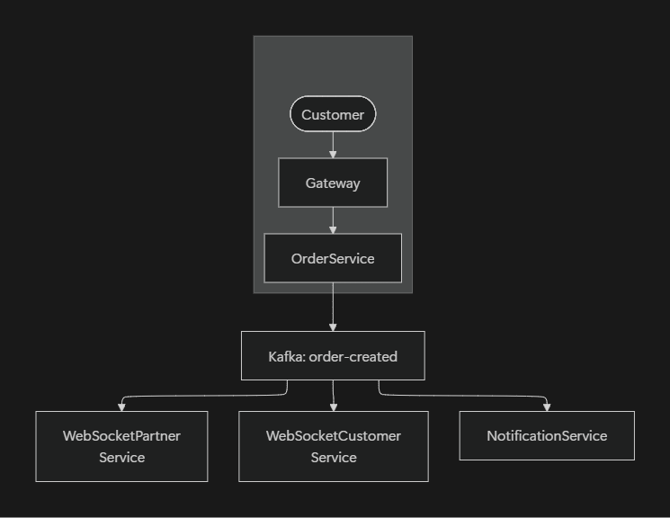
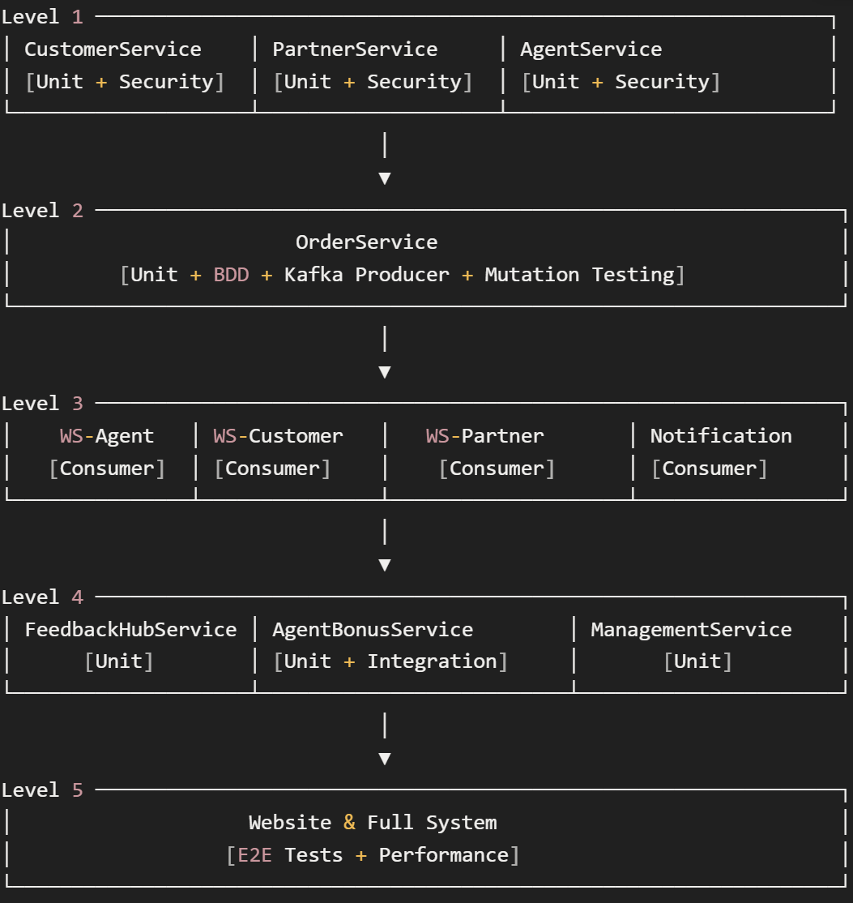

# **Projekt Testplan for MToGo**

Version: 1.0  
Teststrategi-version: 1.0  
Security-plan-version: 1.0  
Dato: 5. december 2025  
Forfattere: Oskar, Peter og Yusuf

## **Indholdsfortegnelse**

- [Formål og Scope](#formål-og-scope)
- [Dokumenthierarki](#dokumenthierarki)
- [Arkitektur](#arkitektur)
- [Test Typer](#test-typer)
- [Modenhedsbaseret Udviklingsplan](#modenhedsbaseret-udviklingsplan)
- [Standard Værktøjer](#standard-værktøjer)
- [Code Coverage Krav](#code-coverage-krav)
- [Entry Criteria](#entry-criteria)
- [Exit Criteria](#exit-criteria)
- [Risikoanalyse](#risikoanalyse)
- [Service Testplaner](#service-testplaner)

## **Formål og Scope**

Dette dokument er den overordnede testplan for MToGo-systemet. Den definerer:

- **Fælles testdefinitioner** som alle services arver
- **Modenhedsbaseret udviklingsplan** der orkestrerer rækkefølgen af services og tilhørende testaktiviteter
- **Shared risks** der gælder på tværs af alle services
- **Fælles værktøjer, coverage krav og entry/exit criteria**

Individuelle service-testplaner refererer til dette dokument for fælles definitioner og dokumenterer kun service-specifikke afvigelser og risici.

## **Dokumenthierarki**

**Anvendelse:**

- Service-testplaner **arver** alle definitioner fra denne fil
- Service-testplaner kan dokumentere **afvigelser** og **service-specifikke risici**

## **Arkitektur**

### Event-Driven Arkitektur

MToGo-systemet anvender bl.a. en **event-driven arkitektur** hvor nogle services kommunikerer via Kafka:

> Note: Cirklen på "Customer" menes at det repræsenterer en kunde som person.

Vores service tests inkludere Testcontainere for PostgreSQL og Kafka for at sikre realistiske testscenarier uden at skulle bruge rigtige eksterne systemer til små-tests.

Dette er en bevidst arkitekturbeslutning, da Kafka og PostgreSQL er fundamentale for hver service. Det giver tests med reelle containers højere tillid end mocking.

## **Test Typer**

### Standard Test Typer

Disse gælder alle services medmindre andet er angivet i individuelle testplaner.

| Test Type                        | Beskrivelse                                                                              | Størrelse                  | Infrastruktur                      |
| -------------------------------- | ---------------------------------------------------------------------------------------- | -------------------------- | ---------------------------------- |
| **Unit Tests**                   | Individuelle komponenter og metoder                                                      | Én metode                  | xUnit                              |
| **Integration Tests**            | Service specifikke tests som benytter sig af Test Containere for at simulere Integration | Service og test containere | PostgreSQL + Kafka test containers |
| **Acceptance Tests**             | API endpoints og Kafka consumers/producers                                               | Service endpoint           | Containers + mocked auth           |
| **Specificationsbaserede Tests** | Baseret på user stories og krav                                                          | User story scope           |                                    |
| **Sikkerhedstests**              | OWASP checks og security scanning                                                        | Service scope              | CI/CD pipeline                     |
| **System Tests**                 | Smoke tests for service health                                                           | Service startup            | CI/CD pipeline                     |

### Avancerede Test Typer (kun relevante services)

| Test Type                          | Beskrivelse                                  | Relevante Services | Hvornår  |
| ---------------------------------- | -------------------------------------------- | ------------------ | -------- |
| **BDD Tests (Reqnroll)**           | Gherkin-scenarier for business-kritisk logik | OrderService       | Level 2+ |
| **Integration Tests**              | Test af flere services sammen i reelt miljø  | Level 4            |
| **Mutation Testing (Stryker.NET)** | Test af test-kvalitet for kritisk logik      | OrderService       | Level 2+ |
| **E2E Tests**                      | Fulde brugerflows gennem hele systemet       | Alle (via Website) | Level 5  |
| **Performance Tests (JMeter)**     | Load og stress testing                       | Alle               | Level 5  |

## **Modenhedsbaseret Udviklingsplan**

Denne sektion definerer rækkefølgen af serviceudvikling og tilhørende testaktiviteter. Hver modenhedsniveau bygger på det forrige.

### Oversigt

| Level | Navn                           | Services                            | Primære Testaktiviteter           |
| ----- | ------------------------------ | ----------------------------------- | --------------------------------- |
| 1     | Foundation Services            | Customer, Partner, Agent            | Unit tests med containers         |
| 2     | Core Order Flow                | Order                               | Unit tests, BDD, Mutation testing |
| 3     | Event Consumers                | WebSocket services, Notification    | Kafka consumer tests              |
| 4     | Aggregation & Support Services | FeedbackHub, AgentBonus, Management | Integration tests                 |
| 5     | System Maturity                | Website, Full system                | E2E tests, Performance tests      |

---

### Level 1: Foundation Services

**Services:** `CustomerService`, `PartnerService`, `AgentService`

**Beskrivelse:** Disse services udgør fundamentet for platformen. De håndterer brugerkonti og skal eksistere før ordreflow kan fungere.

**Testaktiviteter:**

- ✅ Unit tests med PostgreSQL container
- ✅ API acceptance tests
- ✅ Sikkerhedstests (OWASP)
- ✅ CI/CD pipeline med code coverage

**Forventninger ved afslutning:**

- Alle services har >70% code coverage på core komponenter
- Ingen kritiske sikkerhedsfund
- CI/CD pipeline kører automatisk ved PR

**Afhængigheder:** Ingen da disse er uafhængige services

---

### Level 2: Core Order Flow

**Services:** `OrderService`

**Beskrivelse:** OrderService er kernen i platformen og orkestrerer hele ordreflowet via Kafka events.

**Testaktiviteter:**

- ✅ Unit tests med PostgreSQL + Kafka containers
- ✅ BDD tests (Reqnroll) for order state transitions
- ✅ Kafka producer tests (OrderCreated, OrderAccepted, etc.)
- ✅ Mutation testing (Stryker.NET) for OrderAggregate
- ✅ Sikkerhedstests

**Kafka Topics Produceret:**
| Topic | Event | Beskrivelse |
|-------|-------|-------------|
| `order-created` | OrderCreatedEvent | Ny ordre oprettet |
| `order-accepted` | OrderAcceptedEvent | Partner accepterer ordre |
| `order-rejected` | OrderRejectedEvent | Partner afviser ordre |
| `agent-assigned` | AgentAssignedEvent | Agent tildelt ordre |
| `order-ready` | OrderReadyEvent | Ordre klar til afhentning |
| `order-pickedup` | OrderPickedUpEvent | Agent har afhentet ordre |
| `order-delivered` | OrderDeliveredEvent | Ordre leveret til kunde |

**Forventninger ved afslutning:**

- Alle order state transitions testet via BDD
- Mutation score >60% for OrderAggregate
- Kafka producers verificeret

**Afhængigheder:** Level 1 services (Customer, Partner, Agent entities skal eksistere)

---

### Level 3: Event Consumers

**Services:** `WebSocketAgentService`, `WebSocketCustomerService`, `WebSocketPartnerService`, `NotificationService`

**Beskrivelse:** Disse services consumer Kafka events og leverer real-time updates til brugere via WebSocket eller notifikationer.

**Testaktiviteter:**

- ✅ Kafka consumer tests med Kafka test container
- ✅ WebSocket connection management tests
- ✅ Unit tests for message routing logic
- ✅ Sikkerhedstests

**Kafka Topics Konsumeret:**
| Service | Topics |
|---------|--------|
| WebSocketPartnerService | `order-created` |
| WebSocketCustomerService | `order-accepted`, `agent-assigned`, `order-ready`, `order-pickedup`, `order-delivered` |
| WebSocketAgentService | `order-accepted`, `agent-assigned`, `order-ready` |
| NotificationService | `order-accepted`, `agent-assigned`, `order-delivered` |

**Forventninger ved afslutning:**

- Consumer tests verificerer korrekt event håndtering
- WebSocket broadcast logic testet
- End-to-end event flow kan demonstreres manuelt

**Afhængigheder:** Level 2 (OrderService skal producere events)

---

### Level 4: Aggregation & Support Services

**Services:** `FeedbackHubService`, `AgentBonusService`, `ManagementService`

**Beskrivelse:** Disse services aggregerer data på tværs af platformen og understøtter analytics og management funktionalitet.

**Testaktiviteter:**

- ✅ Unit tests med containers
- ✅ Integration tests for service-til-service kommunikation
- ✅ Sikkerhedstests

**Forventninger ved afslutning:**

- Integration tests validerer dataflow mellem services
- Analytics data kan aggregeres korrekt

**Afhængigheder:** Level 1-3 services

---

### Level 5: System Maturity

**Services:** `Website` og hele systemet

**Beskrivelse:** Ved dette niveau er alle services implementeret og testet individuelt. Nu valideres hele systemet som en enhed.

**Testaktiviteter:**

- ✅ E2E tests (fulde brugerflows)
- ✅ Performance tests
- ✅ Load testing
- ✅ Security penetration testing

**E2E Test Scenarios:**
| Scenario | Flow |
|----------|------|
| Ordre oprettelse | Customer login -> Browse partners -> Create order -> Receive confirmation |
| Ordre accept | Partner login -> View orders -> Accept order -> Customer notified |
| Levering | Agent login -> View available -> Accept delivery -> Pickup -> Deliver |
| Feedback | Customer -> Rate order -> Agent bonus updated |

**Performance Test Scenarios:**
| Scenario | Target |
|----------|--------|
| Concurrent orders | 100 simultaneous order creations |
| WebSocket connections | 500 concurrent WebSocket connections |
| Peak load | Simuler 18 millioner ordrer/år kapacitet |

**Forventninger ved afslutning:**

- E2E tests dækker kritiske brugerflows
- Performance baselines etableret
- System klar til produktion

**Afhængigheder:** Alle Level 1-4 services

---

### Modenhedsplan Visualisering

## **Standard Værktøjer**

### Test Frameworks & Libraries

| Værktøj          | Formål             | Anvendelse                       |
| ---------------- | ------------------ | -------------------------------- |
| xUnit            | Test framework     | Alle unit tests                  |
| Moq              | Mocking library    | Mocking af dependencies          |
| FluentAssertions | Assertion library  | Læsbare assertions               |
| Reqnroll         | BDD framework      | Gherkin-scenarier (OrderService) |
| Coverlet         | Code coverage      | Coverage collection              |
| ReportGenerator  | Coverage rapporter | HTML/XML coverage reports        |

### Static Analysis & Quality

| Værktøj     | Formål           | Anvendelse                   |
| ----------- | ---------------- | ---------------------------- |
| StyleCop    | Code style       | Konsistent kode stil         |
| SonarQube   | Static analysis  | Code quality metrics         |
| Stryker.NET | Mutation testing | Test kvalitet (OrderService) |

### Security

| Værktøj  | Formål                 | Anvendelse               |
| -------- | ---------------------- | ------------------------ |
| CodeQL   | SAST                   | Security vulnerabilities |
| Trivy    | Vulnerability scanning | Container + filesystem   |
| Gitleaks | Secret detection       | Credentials i kode       |

### Performance & Monitoring

| Værktøj | Formål              | Anvendelse           |
| ------- | ------------------- | -------------------- |
| JMeter  | Performance testing | Load tests (Level 5) |

### Infrastructure

| Værktøj        | Formål              | Anvendelse                    |
| -------------- | ------------------- | ----------------------------- |
| Docker         | Containerization    | Test containers               |
| Docker Compose | Multi-container     | Local test environment        |
| Testcontainers | Test infrastructure | PostgreSQL + Kafka containers |
| GitHub Actions | CI/CD               | Automated pipelines           |

## **Code Coverage Krav**

Disse krav gælder for **alle services** medmindre andet er specificeret i service-testplanen.

| Metrik | Controller | Service-layer | Repository | Øvrige komponenter |
| ------ | ---------- | ------------- | ---------- | ------------------ |
| Line   | >60%       | >60%          | >60%       | >50%               |
| Branch | >60%       | >60%          | >60%       | >50%               |
| Method | >60%       | >60%          | >60%       | >50%               |

**Undtagelser:**

- Triviel kode (DTOs, simple mappers)
- Infrastructure kode der kræver external dependencies

## **Entry Criteria**

Følgende skal være opfyldt før testaktiviteter kan påbegyndes:

- [ ] Teststrategi og security plan godkendt
- [ ] CI/CD pipeline opsat med test stages
- [ ] DDD-model godkendt
- [ ] Generelle produkt risici identificeret
- [ ] Preliminary arkitekturdesign godkendt
- [ ] Branch protection-regler opsat
- [ ] Test containers konfigureret (PostgreSQL, Kafka)

## **Exit Criteria**

Følgende skal være opfyldt for at erklære test-fasen afsluttet:

- [ ] Code coverage krav opfyldt for alle services
- [ ] Alle planlagte tests gennemført succesfuldt
- [ ] Ingen kritiske eller severe sikkerhedsfund
- [ ] Alle user stories og funktionelle krav testet
- [ ] Test deliverables produceret og reviewet
- [ ] Modenhedsbaserede mål opnået på Level 5

## **Risikoanalyse**

Risikoanalysen for MToGo-systemet er dokumenteret i et separat dokument for at holde det let tilgængeligt og vedligeholdeligt.

**-> Se [shared-risks.md](shared-risks.md) for den komplette risikoanalyse.**

Dokumentet indeholder:

- **Severity & Likelihood definitioner**: Hvordan vi vurderer risici
- **Shared risks**: Organiseret efter kategori (R1-R10)
- **Mitigationsstrategier**: Hver identificeret risiko

Individuelle service-testplaner refererer til [shared-risks.md](shared-risks.md) og tilføjer kun service-specifikke risici med fortsættende nummerering (f.eks. R7.6, R10.8).

## **Service Testplaner**

Følgende service-specifikke testplaner er tilgængelige. Hver plan refererer til dette dokument for fælles definitioner og dokumenterer kun service-specifikke afvigelser og risici.

### Level 1: Foundation Services

- [customer-service-test-plan.md](customer-service-test-plan.md)
- [partner-service-test-plan.md](partner-service-test-plan.md)
- [agent-service-test-plan.md](agent-service-test-plan.md)

### Level 2: Core Flow

- [order-service-test-plan.md](order-service-test-plan.md)

### Level 3: Event Consumers

- [websocket-agent-service-test-plan.md](websocket-agent-service-test-plan.md)
- [websocket-customer-service-test-plan.md](websocket-customer-service-test-plan.md)
- [websocket-partner-service-test-plan.md](websocket-partner-service-test-plan.md)
- [notification-service-test-plan.md](notification-service-test-plan.md)

### Level 4: Aggregation & Support

- [feedback-hub-service-test-plan.md](feedback-hub-service-test-plan.md)
- [agent-bonus-service-test-plan.md](agent-bonus-service-test-plan.md)

### Level 5: System

- [website-service-test-plan.md](website-service-test-plan.md)

---

_Dette dokument opdateres løbende baseret på projektets progression og erfaringer._
