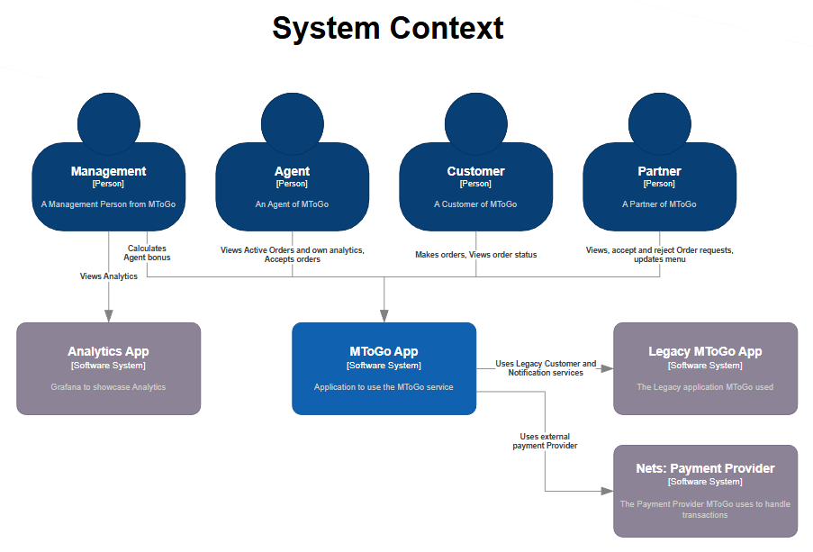
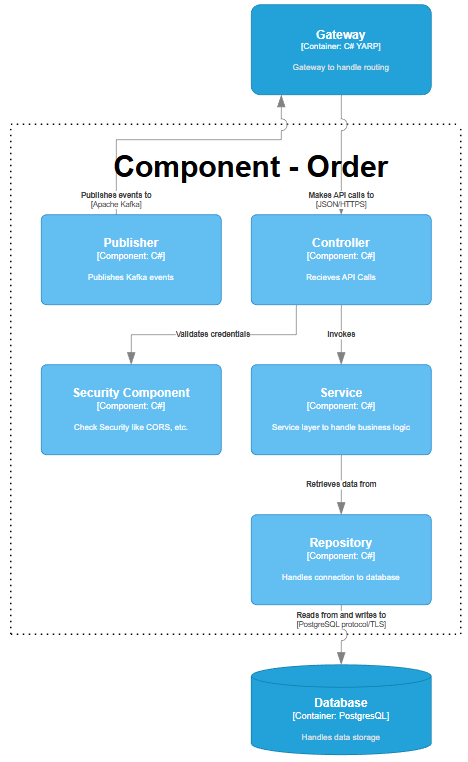
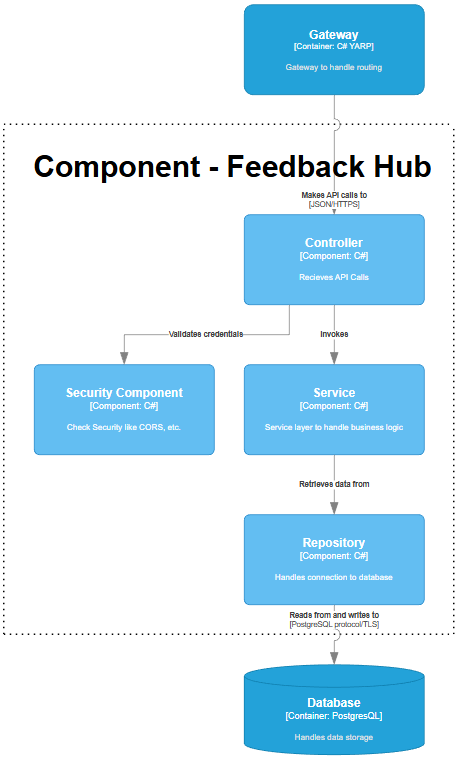
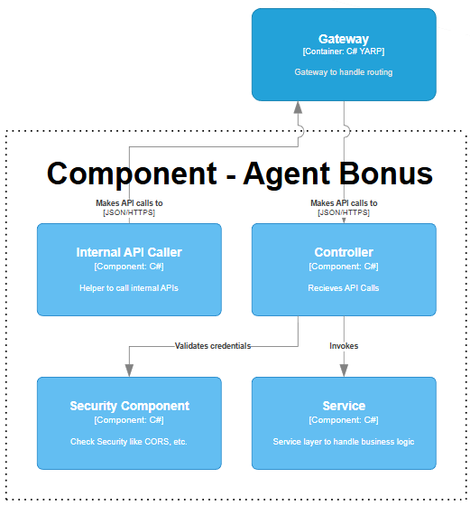
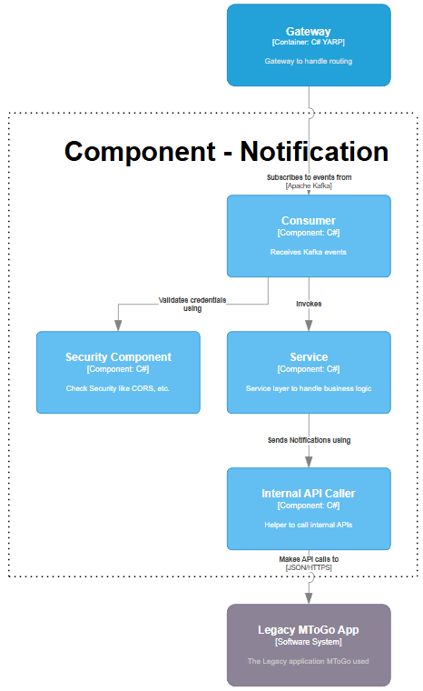
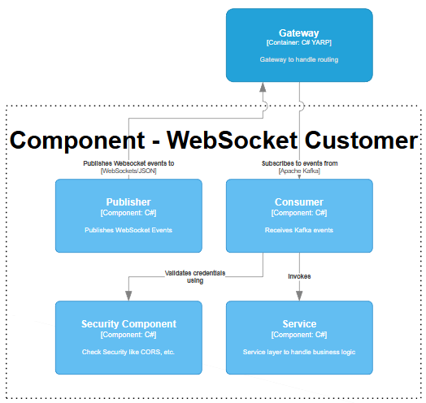
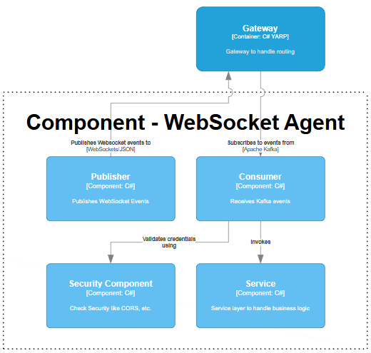

# MToGo - Systemarkitektur

Dette dokument beskriver den overordnede systemarkitektur for MToGo-applikationen, herunder API-information og C4-modeller samt detaljer om de forskellige services i systemet.

## Indholdsfortegnelse

- [API Information](#api-information)
- [C4 Model](#c4-model)
- [Frontend Service](#frontend-service)
- [Order Service](#order-service)
- [Partner Service](#partner-service)
- [Feedback Hub Service](#feedback-hub-service)
- [Customer Service](#customer-service)
- [Agent Service](#agent-service)
- [Agent Bonus Service](#agent-bonus-service)
- [Notification Service](#notification-service)
- [WebSocket Customer Service](#websocket-customer-service)
- [WebSocket Partner Service](#websocket-partner-service)
- [WebSocket Agent Service](#websocket-agent-service)
- [Kafka Event Service](#kafka-event-service)

## API Information

### Authentication

- Alle requests (ekslusiv login) til API'erne kræver JWT (JSON Web Token) for authentication og authorization.
- JWT-tokens skal inkluderes i Authorization-headeren som Bearer-token for at sikre sikker adgang.

### Endpoint-Struktur

- Alle REST API-endpoints starter med `/api/v1`.
- Alle WebSocket-endpoints starter med `/api/v1/ws`.

### Sikkerhed og Adgang

- Alle services er interne og kan kun tilgås via Gatewayen. Direkte adgang til services fra eksterne klienter er ikke tilladt.
- Gatewayen fungerer som en proxy og håndterer routing.

### Response-Koder

- **200 OK**: Bruges for succesfulde operationer med data, f.eks. hentning af ressourcer.
- **201 Created**: Bruges når en ny ressource er oprettet, f.eks. ved oprettelse af brugere eller ordrer.
- **204 No Content**: Bruges for operationer hvor ingen data returneres, men klienten skal vide at operationen er fuldført, f.eks. opdateringer eller sletninger.
- **400 Bad Request**: Bruges for ugyldige requests, f.eks. manglende eller forkerte parametre.
- **401 Unauthorized**: Bruges for manglende eller ugyldig autentificering, f.eks. uden gyldigt JWT-token.
- **403 Forbidden**: Bruges når adgang er nægtet, f.eks. på grund af utilstrækkelige rettigheder.
- **404 Not Found**: Bruges når en ressource ikke findes, f.eks. ukendt ID.
- **500 Internal Server Error**: Bruges for serverfejl, f.eks. uventede fejl i backend.

### Teknisk Implementering

- Gatewayen er implementeret ved hjælp af C# og YARP (Yet Another Reverse Proxy), som er et open-source reverse proxy-bibliotek fra Microsoft. Dette giver effektiv routing.
- Dataformater: Alle API'er kommunikerer med JSON. Data typer er defineret som klasser/modeller i C# for at sikre type-sikkerhed og konsistens.
- WebSockets bruges til realtids-kommunikation, såsom live-opdateringer.

## C4 Model

Vi har brugt C4-modellering til at beskrive systemets arkitektur på forskellige niveauer af detaljer.  
En samlet oversigt kan findes inde på dette link:  
[https://drive.google.com/file/d/1LMQYstO4bs9l7I8GLsPPaoj-\_bEhM04L/view?usp=sharing](https://drive.google.com/file/d/1LMQYstO4bs9l7I8GLsPPaoj-_bEhM04L/view?usp=sharing)

### System Context Diagram

**MToGo App**:  
MToGo er en madleveringsplatform, der forbinder kunder med restauranter og leveringsagenter. Systemet håndterer ordreoprettelse, betaling, tracking og kommunikation i realtid via API'er, WebSockets og Kafka-events.

**Brugere**:

- **Kunder**: Privatpersoner, der bestiller mad via hjemmesiden. De kan oprette profiler, søge efter restauranter, placere ordrer, tracke leveringer og give feedback.
- **Partnere**: Restauranter eller madleverandører, der bruger hjemmesiden til at administrere menuer, acceptere/afvise ordrer og opdatere ordrestatus.
- **Agenter**: Leveringschauffører, der bruger hjemmesiden til at modtage ordrer, opdatere status og navigere til leveringssteder.
- **Management**: Administratorer, der overvåger systemet via hjemmesiden og ekstern Analytics App. De kan også give bonusser til agenter baseret på performance.

**Eksterne Systemer**:

- **Nets: Payment Provider** : Håndterer sikre betalinger for ordrer.
- **Analytics App**: Ekstern Grafana applikation til avanceret dataanalyse og rapportering baseret på MToGo-data.
- **Legacy MToGo App**: Tidligere version af MToGo-systemet, som stadig bruges til visse funktioner og data.

**Interaktioner**:

- Kunder interagerer med MToGo App via REST API og WebSockets for ordreoprettelse, statusopdateringer og feedback.
- Partnere modtager ordre-notifikationer via WebSockets, og opdaterer ordre via API.
- Agenter abonnerer på nye ordrer via WebSockets og rapporterer statusændringer via API.
- Systemet kommunikerer med eksterne systemer via API-kald.
- Alle interaktioner er sikret via JWT-autentificering og gateway-routing.

### Container Diagram

_Dette billede kan være svært at læse; billedet kan findes i [/img/container-diagram.png](./img/container-diagram.png)_

**Service Arkitektur**:  
MToGo-systemet er bygget som en service-arkitektur, hvor hver service kører som en separat container. Services kommunikerer via REST API'er, WebSockets og Kafka-events for løs kobling og skalerbarhed. Gatewayen fungerer som en central indgangspunkt for alle eksterne requests.

**Containere i Systemet**:

- **Gateway**: Reverse proxy (C# YARP) der håndterer routing, autentificering, load balancing og sikkerhed.
- **Order Service**: Håndterer ordreoprettelse, -administration og -tracking.
- **Partner Service**: Administrerer partnere og deres menuer.
- **Customer Service**: Håndterer kunderegistrering og -profilering via Legacy MToGo App.
- **Agent Service**: Administrerer leveringsagenter.
- **Agent Bonus Calculation Service**: Beregner bonusser for agenter baseret på performance.
- **Feedback Hub Service**: Indsamler og administrerer anmeldelser og feedback.
- **Notification Service**: Sender notifikationer via Legacy MToGo App.
- **WebSocket Services** (Customer, Partner, Agent): Håndterer realtids-kommunikation via WebSockets.
- **Kafka Event Service**: Publicerer events til Kafka for asynkron kommunikation.
- **Website**: Enkelt applikationer uden underkomponenter.
- **Database**: Fælles PostgresQL database for persistens.

**Eksterne Systemer**:

- **Nets: Payment Provider** : Håndterer sikre betalinger for ordrer fra Website.
- **Legacy MToGo App**: Tidligere version af MToGo-systemet, som stadig bruges til visse funktioner og data fra Customer og Notification Services.

**Interaktioner**:

- Frontend UIs kalder Gatewayen via REST API'er og WebSockets.
- Services kommunikerer internt via API-kald og Kafka-events.
- Gatewayen dirigerer requests til relevante services og håndterer autentificering.
- Eksterne systemer integreres via API-kald fra relevante services (f.eks. betaling fra Website).

### Component Diagrammer

Component diagrammer er beskrevet og vist under deres respektive service sektioner nedenfor.

## Frontend Service

Der er ikke nogen komponent diagram for frontenden, da det er en enkelt applikation uden yderligere underkomponenter, men vi har en Figma [frontend-wireframe.md](frontend-wireframe.md) hvor designet og brugerflowet er vist.

Der kommer til at være 4 separate frontend UIs, alle under samme hjemmeside, men man bliver dirigeret til den rigtige afhængig af login rolle.

### Customer UI

Lytter på WebSocket events: OrderAccepted, OrderRejected, OrderPickedUp, OrderDelivered

### Partner UI

Lytter på WebSocket events: OrderCreated, AgentAssigned

### Agent UI

Lytter på WebSocket events: OrderAccepted, OrderReady

### Management UI

## Order Service

#### Component Diagram

Dette diagram viser komponenterne i Order Service, herunder:

- **Controller**: Håndterer REST-endpoints for ordreoprettelse, opdatering og hentning.
- **Event Publishers**: Sender Kafka-events for ordreændringer.
- **Service**: Indeholder logik for ordrevalidering, statusopdateringer og beregninger.
- **Repository**: Repositories for database-interaktioner med ordre-tabellen.
- **Security Component**: Håndterer autentificering og autorisation for ordre-relaterede operationer.

### API

Alle endpoints starter med /orders/

Vi opretter en ny ordre med både foodItemId og name for at sikre data konsistens hvis nu et foodItem skulle ændres af en partner, og id er med for man altid kan backtrack til hvor det kommer fra.

| Endpoint (Method)                    | Description                      | Request body                                                                                                                                                                                                                                                                                                                                                                                                                                                                                                                                                                 | Response schema                                                                                                                                                                                                                                                                                                                                                                                                                                                                                                                                                                                                                                                                                                                                                                                                                                                                                                                                                                                                                                                                                                                                                                                              |
| :----------------------------------- | :------------------------------- | :--------------------------------------------------------------------------------------------------------------------------------------------------------------------------------------------------------------------------------------------------------------------------------------------------------------------------------------------------------------------------------------------------------------------------------------------------------------------------------------------------------------------------------------------------------------------------- | :----------------------------------------------------------------------------------------------------------------------------------------------------------------------------------------------------------------------------------------------------------------------------------------------------------------------------------------------------------------------------------------------------------------------------------------------------------------------------------------------------------------------------------------------------------------------------------------------------------------------------------------------------------------------------------------------------------------------------------------------------------------------------------------------------------------------------------------------------------------------------------------------------------------------------------------------------------------------------------------------------------------------------------------------------------------------------------------------------------------------------------------------------------------------------------------------------------- |
| /order/ (POST)                       | Opret ny ordre                   | { &nbsp;&nbsp;"customerId": "integer", &nbsp;&nbsp;"partnerId": "integer", &nbsp;&nbsp;"deliveryAddress": "string", &nbsp;&nbsp;"serviceFee": "decimal", &nbsp;&nbsp;"deliveryFee": "decimal", &nbsp;&nbsp;"items": [ &nbsp;&nbsp;&nbsp;&nbsp;{ &nbsp;&nbsp;&nbsp;&nbsp;&nbsp;&nbsp;"foodItemId": "integer", &nbsp;&nbsp;&nbsp;&nbsp;&nbsp;&nbsp;"name": "string", &nbsp;&nbsp;&nbsp;&nbsp;&nbsp;&nbsp;"quantity": "integer", &nbsp;&nbsp;&nbsp;&nbsp;&nbsp;&nbsp;"unitPrice": "decimal" &nbsp;&nbsp;&nbsp;&nbsp;} &nbsp;&nbsp;] } | 201  { &nbsp;&nbsp;"id": "integer" }                                                                                                                                                                                                                                                                                                                                                                                                                                                                                                                                                                                                                                                                                                                                                                                                                                                                                                                                                                                                                                                                                                                                                             |
| /order/{id}/accept (POST)            | Partner acceptere en ordre       |                                                                                                                                                                                                                                                                                                                                                                                                                                                                                                                                                                              | 204                                                                                                                                                                                                                                                                                                                                                                                                                                                                                                                                                                                                                                                                                                                                                                                                                                                                                                                                                                                                                                                                                                                                                                                                          |
| /order/{id}/reject (POST)            | Partner afviser en ordre         |                                                                                                                                                                                                                                                                                                                                                                                                                                                                                                                                                                              | 204                                                                                                                                                                                                                                                                                                                                                                                                                                                                                                                                                                                                                                                                                                                                                                                                                                                                                                                                                                                                                                                                                                                                                                                                          |
| /order/{id}/assign-agent (POST)      | Agent har taget en ordre-request | { &nbsp;&nbsp;"agentId": "integer" }                                                                                                                                                                                                                                                                                                                                                                                                                                                                                                                                   | 204                                                                                                                                                                                                                                                                                                                                                                                                                                                                                                                                                                                                                                                                                                                                                                                                                                                                                                                                                                                                                                                                                                                                                                                                          |
| /order/{id}/set-ready (POST)         | Partner er færdig med ordre      |                                                                                                                                                                                                                                                                                                                                                                                                                                                                                                                                                                              | 204                                                                                                                                                                                                                                                                                                                                                                                                                                                                                                                                                                                                                                                                                                                                                                                                                                                                                                                                                                                                                                                                                                                                                                                                          |
| /order/{id}/pickup (POST)            | Agent afhenter en ordre          |                                                                                                                                                                                                                                                                                                                                                                                                                                                                                                                                                                              | 204                                                                                                                                                                                                                                                                                                                                                                                                                                                                                                                                                                                                                                                                                                                                                                                                                                                                                                                                                                                                                                                                                                                                                                                                          |
| /order/{id}/complete-delivery (POST) | Agent har afleveret ordre        |                                                                                                                                                                                                                                                                                                                                                                                                                                                                                                                                                                              | 204                                                                                                                                                                                                                                                                                                                                                                                                                                                                                                                                                                                                                                                                                                                                                                                                                                                                                                                                                                                                                                                                                                                                                                                                          |
| /order/{id}/status (GET)             | Tjek status                      |                                                                                                                                                                                                                                                                                                                                                                                                                                                                                                                                                                              | 200  { &nbsp;&nbsp;"status": "string" }                                                                                                                                                                                                                                                                                                                                                                                                                                                                                                                                                                                                                                                                                                                                                                                                                                                                                                                                                                                                                                                                                                                                                          |
| /order/{id} (GET)                    | Tjek order information           |                                                                                                                                                                                                                                                                                                                                                                                                                                                                                                                                                                              | 200  { &nbsp;&nbsp;"id": "integer", &nbsp;&nbsp;"customerId": "integer", &nbsp;&nbsp;"partnerId": "integer", &nbsp;&nbsp;"agentId": "integer", &nbsp;&nbsp;"deliveryAddress": "string", &nbsp;&nbsp;"serviceFee": "decimal", &nbsp;&nbsp;"deliveryFee": "decimal", &nbsp;&nbsp;"status": "string", &nbsp;&nbsp;"orderCreatedTime": "string", &nbsp;&nbsp;"items": [ &nbsp;&nbsp;&nbsp;&nbsp;{ &nbsp;&nbsp;&nbsp;&nbsp;&nbsp;&nbsp;"foodItemId": "integer", &nbsp;&nbsp;&nbsp;&nbsp;&nbsp;&nbsp;"name": "string", &nbsp;&nbsp;&nbsp;&nbsp;&nbsp;&nbsp;"quantity": "integer", &nbsp;&nbsp;&nbsp;&nbsp;&nbsp;&nbsp;"unitPrice": "decimal" &nbsp;&nbsp;&nbsp;&nbsp;} &nbsp;&nbsp;] }                                                                                                                                                                                                                                                                                                                                                                                                                                                                 |
| /customer/{id} (GET)                 | Hent alle orders fra en customer | (optional) { &nbsp;&nbsp;"startDate": "string", &nbsp;&nbsp;"endDate": "string", &nbsp;&nbsp;"amount": "integer" }                                                                                                                                                                                                                                                                                                                                                                                                                                            | 200  { &nbsp;&nbsp;"array": [ &nbsp;&nbsp;&nbsp;&nbsp;{ &nbsp;&nbsp;&nbsp;&nbsp;&nbsp;&nbsp;"id": "integer", &nbsp;&nbsp;&nbsp;&nbsp;&nbsp;&nbsp;"partnerId": "integer", &nbsp;&nbsp;&nbsp;&nbsp;&nbsp;&nbsp;"agentId": "integer", &nbsp;&nbsp;&nbsp;&nbsp;&nbsp;&nbsp;"deliveryAddress": "string", &nbsp;&nbsp;&nbsp;&nbsp;&nbsp;&nbsp;"serviceFee": "decimal", &nbsp;&nbsp;&nbsp;&nbsp;&nbsp;&nbsp;"deliveryFee": "decimal", &nbsp;&nbsp;&nbsp;&nbsp;&nbsp;&nbsp;"status": "string", &nbsp;&nbsp;&nbsp;&nbsp;&nbsp;&nbsp;"orderCreatedTime": "string", &nbsp;&nbsp;&nbsp;&nbsp;&nbsp;&nbsp;"items": [ &nbsp;&nbsp;&nbsp;&nbsp;&nbsp;&nbsp;&nbsp;&nbsp;{ &nbsp;&nbsp;&nbsp;&nbsp;&nbsp;&nbsp;&nbsp;&nbsp;&nbsp;&nbsp;"foodItemId": "integer", &nbsp;&nbsp;&nbsp;&nbsp;&nbsp;&nbsp;&nbsp;&nbsp;&nbsp;&nbsp;"name": "string", &nbsp;&nbsp;&nbsp;&nbsp;&nbsp;&nbsp;&nbsp;&nbsp;&nbsp;&nbsp;"quantity": "integer", &nbsp;&nbsp;&nbsp;&nbsp;&nbsp;&nbsp;&nbsp;&nbsp;&nbsp;&nbsp;"unitPrice": "decimal" &nbsp;&nbsp;&nbsp;&nbsp;&nbsp;&nbsp;&nbsp;&nbsp;} &nbsp;&nbsp;&nbsp;&nbsp;&nbsp;&nbsp;] &nbsp;&nbsp;&nbsp;&nbsp;} &nbsp;&nbsp;] }    |
| /partner/{id} (GET)                  | Hent alle orders fra en partner  | (optional) { &nbsp;&nbsp;"startDate": "string", &nbsp;&nbsp;"endDate": "string", &nbsp;&nbsp;"amount": "integer" }                                                                                                                                                                                                                                                                                                                                                                                                                                            | 200  { &nbsp;&nbsp;"array": [ &nbsp;&nbsp;&nbsp;&nbsp;{ &nbsp;&nbsp;&nbsp;&nbsp;&nbsp;&nbsp;"id": "integer", &nbsp;&nbsp;&nbsp;&nbsp;&nbsp;&nbsp;"customerId": "integer", &nbsp;&nbsp;&nbsp;&nbsp;&nbsp;&nbsp;"agentId": "integer", &nbsp;&nbsp;&nbsp;&nbsp;&nbsp;&nbsp;"deliveryAddress": "string", &nbsp;&nbsp;&nbsp;&nbsp;&nbsp;&nbsp;"serviceFee": "decimal", &nbsp;&nbsp;&nbsp;&nbsp;&nbsp;&nbsp;"deliveryFee": "decimal", &nbsp;&nbsp;&nbsp;&nbsp;&nbsp;&nbsp;"status": "string", &nbsp;&nbsp;&nbsp;&nbsp;&nbsp;&nbsp;"orderCreatedTime": "string", &nbsp;&nbsp;&nbsp;&nbsp;&nbsp;&nbsp;"items": [ &nbsp;&nbsp;&nbsp;&nbsp;&nbsp;&nbsp;&nbsp;&nbsp;{ &nbsp;&nbsp;&nbsp;&nbsp;&nbsp;&nbsp;&nbsp;&nbsp;&nbsp;&nbsp;"foodItemId": "integer", &nbsp;&nbsp;&nbsp;&nbsp;&nbsp;&nbsp;&nbsp;&nbsp;&nbsp;&nbsp;"name": "string", &nbsp;&nbsp;&nbsp;&nbsp;&nbsp;&nbsp;&nbsp;&nbsp;&nbsp;&nbsp;"quantity": "integer", &nbsp;&nbsp;&nbsp;&nbsp;&nbsp;&nbsp;&nbsp;&nbsp;&nbsp;&nbsp;"unitPrice": "decimal" &nbsp;&nbsp;&nbsp;&nbsp;&nbsp;&nbsp;&nbsp;&nbsp;} &nbsp;&nbsp;&nbsp;&nbsp;&nbsp;&nbsp;] &nbsp;&nbsp;&nbsp;&nbsp;} &nbsp;&nbsp;] }   |
| /agent/{id} (GET)                    | Hent alle orders fra en agent    | (optional)  { &nbsp;&nbsp;"startDate": "string", &nbsp;&nbsp;"endDate": "string", &nbsp;&nbsp;"amount": "integer" }                                                                                                                                                                                                                                                                                                                                                                                                                                           | 200  { &nbsp;&nbsp;"array": [ &nbsp;&nbsp;&nbsp;&nbsp;{ &nbsp;&nbsp;&nbsp;&nbsp;&nbsp;&nbsp;"id": "integer", &nbsp;&nbsp;&nbsp;&nbsp;&nbsp;&nbsp;"customerId": "integer", &nbsp;&nbsp;&nbsp;&nbsp;&nbsp;&nbsp;"partnerId": "integer", &nbsp;&nbsp;&nbsp;&nbsp;&nbsp;&nbsp;"deliveryAddress": "string", &nbsp;&nbsp;&nbsp;&nbsp;&nbsp;&nbsp;"serviceFee": "decimal", &nbsp;&nbsp;&nbsp;&nbsp;&nbsp;&nbsp;"deliveryFee": "decimal", &nbsp;&nbsp;&nbsp;&nbsp;&nbsp;&nbsp;"status": "string", &nbsp;&nbsp;&nbsp;&nbsp;&nbsp;&nbsp;"orderCreatedTime": "string", &nbsp;&nbsp;&nbsp;&nbsp;&nbsp;&nbsp;"items": [ &nbsp;&nbsp;&nbsp;&nbsp;&nbsp;&nbsp;&nbsp;&nbsp;{ &nbsp;&nbsp;&nbsp;&nbsp;&nbsp;&nbsp;&nbsp;&nbsp;&nbsp;&nbsp;"foodItemId": "integer", &nbsp;&nbsp;&nbsp;&nbsp;&nbsp;&nbsp;&nbsp;&nbsp;&nbsp;&nbsp;"name": "string", &nbsp;&nbsp;&nbsp;&nbsp;&nbsp;&nbsp;&nbsp;&nbsp;&nbsp;&nbsp;"quantity": "integer", &nbsp;&nbsp;&nbsp;&nbsp;&nbsp;&nbsp;&nbsp;&nbsp;&nbsp;&nbsp;"unitPrice": "decimal" &nbsp;&nbsp;&nbsp;&nbsp;&nbsp;&nbsp;&nbsp;&nbsp;} &nbsp;&nbsp;&nbsp;&nbsp;&nbsp;&nbsp;] &nbsp;&nbsp;&nbsp;&nbsp;} &nbsp;&nbsp;] } |

### Events Published

| Event               | Required Schema                                                                                                                                                                                                                                                                                                                                                                                                                                                                                                               |
| :------------------ | :---------------------------------------------------------------------------------------------------------------------------------------------------------------------------------------------------------------------------------------------------------------------------------------------------------------------------------------------------------------------------------------------------------------------------------------------------------------------------------------------------------------------------- |
| OrderCreatedEvent   | { &nbsp;&nbsp;"orderId": "integer", &nbsp;&nbsp;"partnerId": "integer", &nbsp;&nbsp;"orderCreatedTime": "string", &nbsp;&nbsp;"items": [ &nbsp;&nbsp;&nbsp;&nbsp;{ &nbsp;&nbsp;&nbsp;&nbsp;&nbsp;&nbsp;"name": "string", &nbsp;&nbsp;&nbsp;&nbsp;&nbsp;&nbsp;"quantity": "integer" &nbsp;&nbsp;&nbsp;&nbsp;} &nbsp;&nbsp;] }                                                                                                                                                                    |
| OrderAcceptedEvent  | { &nbsp;&nbsp;"orderId": "integer", &nbsp;&nbsp;"customerId": "integer", &nbsp;&nbsp;"partnerName": "string", &nbsp;&nbsp;"partnerAddress": "string", &nbsp;&nbsp;"deliveryAddress": "string", &nbsp;&nbsp;"deliveryFee": "decimal", &nbsp;&nbsp;"timestamp": "string", &nbsp;&nbsp;"items": [ &nbsp;&nbsp;&nbsp;&nbsp;{ &nbsp;&nbsp;&nbsp;&nbsp;&nbsp;&nbsp;"name": "string", &nbsp;&nbsp;&nbsp;&nbsp;&nbsp;&nbsp;"quantity": "integer", &nbsp;&nbsp;&nbsp;&nbsp;} &nbsp;&nbsp;] } |
| OrderRejectedEvent  | { &nbsp;&nbsp;"orderId": "integer", &nbsp;&nbsp;"customerId": "integer", &nbsp;&nbsp;"reason": "string", &nbsp;&nbsp;"timestamp": "string" }                                                                                                                                                                                                                                                                                                                                                                   |
| AgentAssignedEvent  | { &nbsp;&nbsp;"orderId": "integer", &nbsp;&nbsp;"partnerId": "integer", &nbsp;&nbsp;"agentId": "integer", &nbsp;&nbsp;"timestamp": "string" }                                                                                                                                                                                                                                                                                                                                                                  |
| OrderReadyEvent     | { &nbsp;&nbsp;"orderId": "integer", &nbsp;&nbsp;"customerId": "integer", &nbsp;&nbsp;"partnerName": "string", &nbsp;&nbsp;"partnerAddress": "string", &nbsp;&nbsp;"agentId": "integer", &nbsp;&nbsp;"timestamp": "string" }                                                                                                                                                                                                                                                                              |
| OrderPickedUpEvent  | { &nbsp;&nbsp;"orderId": "integer", &nbsp;&nbsp;"partnerId": "integer", &nbsp;&nbsp;"customerId": "integer", &nbsp;&nbsp;"agentName": "string", &nbsp;&nbsp;"timestamp": "string" }                                                                                                                                                                                                                                                                                                                                                                |
| OrderDeliveredEvent | { &nbsp;&nbsp;"orderId": "integer", &nbsp;&nbsp;"customerId": "integer", &nbsp;&nbsp;"timestamp": "string" }                                                                                                                                                                                                                                                                                                                                                                                                      |

## Partner Service

### Component Diagram

Dette diagram viser komponenterne i Partner Service, herunder:

- **API Controllers**: Håndterer REST-endpoints for partner- og menu-administration.
- **Service**: Indeholder logik for partnerregistrering, menuopdateringer og datahentning.
- **Repository**: Repositories for database-interaktioner med partner- og menu-tabeller.
- **Security Component**: Håndterer autentificering og autorisation for partner-relaterede operationer.

### API

Alle endpoints starter med /partners/

| Endpoint (Method)                      | Description                 | Request body                                                                                                                                                                                                                                                                                                                                                               | Response schema                                                                                                                                                                                                                           |
| :------------------------------------- | :-------------------------- | :------------------------------------------------------------------------------------------------------------------------------------------------------------------------------------------------------------------------------------------------------------------------------------------------------------------------------------------------------------------------- | :---------------------------------------------------------------------------------------------------------------------------------------------------------------------------------------------------------------------------------------- |
| / (POST)                               | Nyoprettet partner          | { &nbsp;&nbsp;"name": "string", &nbsp;&nbsp;"location": "string", &nbsp;&nbsp;"email": "string", &nbsp;&nbsp;"password": "string", &nbsp;&nbsp;"menu": [ &nbsp;&nbsp;&nbsp;&nbsp;{ &nbsp;&nbsp;&nbsp;&nbsp;&nbsp;&nbsp;"name": "string", &nbsp;&nbsp;&nbsp;&nbsp;&nbsp;&nbsp;"price": "decimal" &nbsp;&nbsp;&nbsp;&nbsp;} &nbsp;&nbsp;] } | 201  { &nbsp;&nbsp;"id": "integer" }                                                                                                                                                                                          |
| /login (POST)                          | Log ind en partner          | { &nbsp;&nbsp;"email": "string", &nbsp;&nbsp;"password": "string" }                                                                                                                                                                                                                                                                                               | 200  { &nbsp;&nbsp;"jwt": "string" }                                                                                                                                                                                          |
| /{id} (GET)                            | Hent information om Partner |                                                                                                                                                                                                                                                                                                                                                                            | 200  { &nbsp;&nbsp;"id": "integer", &nbsp;&nbsp;"name": "string", &nbsp;&nbsp;"location": "string" }                                                                                                                    |
| /{id}/menu/items (POST)                | Opret nyt food item         | { &nbsp;&nbsp;"name": "string", &nbsp;&nbsp;"price": "decimal" }                                                                                                                                                                                                                                                                                                  | 201  { &nbsp;&nbsp;"id": "integer" }                                                                                                                                                                                          |
| /{id}/menu/items/{foodItemId} (PATCH)  | Opdater food item           | (optional) { &nbsp;&nbsp;"name": "string", &nbsp;&nbsp;"price": "decimal" }                                                                                                                                                                                                                                                                                    | 200                                                                                                                                                                                                                                       |
| /{id}/menu/items/{foodItemId} (DELETE) | Slet et food item           |                                                                                                                                                                                                                                                                                                                                                                            | 200                                                                                                                                                                                                                                       |
| /{id}/menu/items/{foodItemId} (GET)    | Hent et food item           |                                                                                                                                                                                                                                                                                                                                                                            | 200   { &nbsp;&nbsp;"name": "string", &nbsp;&nbsp;"price": "decimal" }                                                                                                                                                     |
| /{id}/menu (GET)                       | Hent en menu                |                                                                                                                                                                                                                                                                                                                                                                            | 200  { &nbsp;&nbsp;"array": [ &nbsp;&nbsp;&nbsp;&nbsp;{ &nbsp;&nbsp;&nbsp;&nbsp;&nbsp;&nbsp;"name": "string", &nbsp;&nbsp;&nbsp;&nbsp;&nbsp;&nbsp;"price": "decimal" &nbsp;&nbsp;&nbsp;&nbsp;} &nbsp;&nbsp;] } |

## Feedback Hub Service

### Component Diagram

Dette diagram viser komponenterne i Feedback Hub Service, herunder:

- **API Controllers**: Håndterer REST-endpoints for oprettelse og hentning af reviews.
- **Service**: Indeholder logik for validering og behandling af reviews.
- **Repository**: Repositories for database-interaktioner med review-tabellen.
- **Security Component**: Håndterer autentificering og autorisation for review-relaterede operationer.

### API

Alle endpoints starter med /feedback-hub/

| Endpoint (Method)             | Description                             | Request body                                                                                                                                                                                                                                                                                                                                                                                                                                                                                                                                                                         | Response schema                                                                                                                                                                                                                                                                                                                                                                                                                                                                                                                                                                                                                                                                                                                                                                                                                                                                                                                                                                                                 |
| :---------------------------- | :-------------------------------------- | :----------------------------------------------------------------------------------------------------------------------------------------------------------------------------------------------------------------------------------------------------------------------------------------------------------------------------------------------------------------------------------------------------------------------------------------------------------------------------------------------------------------------------------------------------------------------------------- | :-------------------------------------------------------------------------------------------------------------------------------------------------------------------------------------------------------------------------------------------------------------------------------------------------------------------------------------------------------------------------------------------------------------------------------------------------------------------------------------------------------------------------------------------------------------------------------------------------------------------------------------------------------------------------------------------------------------------------------------------------------------------------------------------------------------------------------------------------------------------------------------------------------------------------------------------------------------------------------------------------------------- |
| /reviews/ (POST)              | Opret nyt review                        | { &nbsp;&nbsp;"orderId": "integer", &nbsp;&nbsp;"agentId": "integer", &nbsp;&nbsp;"partnerId": "integer", &nbsp;&nbsp;"customerId": "integer", &nbsp;&nbsp;"timestamp": "string", &nbsp;&nbsp;"ratings": { &nbsp;&nbsp;&nbsp;&nbsp;"food": "integer", &nbsp;&nbsp;&nbsp;&nbsp;"agent": "integer", &nbsp;&nbsp;&nbsp;&nbsp;"order": "integer" &nbsp;&nbsp;}, &nbsp;&nbsp;"comments": { &nbsp;&nbsp;&nbsp;&nbsp;"food": "string", &nbsp;&nbsp;&nbsp;&nbsp;"agent": "string", &nbsp;&nbsp;&nbsp;&nbsp;"order": "string" &nbsp;&nbsp;} } | 201  { &nbsp;&nbsp;"id": "integer" }                                                                                                                                                                                                                                                                                                                                                                                                                                                                                                                                                                                                                                                                                                                                                                                                                                                                                                                                                                |
| /reviews/orders/{id} (GET)    | Hent ordre review på en ordre           |                                                                                                                                                                                                                                                                                                                                                                                                                                                                                                                                                                                      | 200  { &nbsp;&nbsp;"agentId": "integer", &nbsp;&nbsp;"partnerId": "integer", &nbsp;&nbsp;"customerId": "integer", &nbsp;&nbsp;"timestamp": "string", &nbsp;&nbsp;"ratings": { &nbsp;&nbsp;&nbsp;&nbsp;"food": "integer", &nbsp;&nbsp;&nbsp;&nbsp;"agent": "integer", &nbsp;&nbsp;&nbsp;&nbsp;"order": "integer" &nbsp;&nbsp;}, &nbsp;&nbsp;"comments": { &nbsp;&nbsp;&nbsp;&nbsp;"food": "string", &nbsp;&nbsp;&nbsp;&nbsp;"agent": "string", &nbsp;&nbsp;&nbsp;&nbsp;"order": "string" &nbsp;&nbsp;} }                                                                                                                                                                                                                                                                                                                                                                                                                                                      |
| /reviews/orders (GET)         | Hent alle ordre reviews                 | (optional) { &nbsp;&nbsp;"startDate": "string", &nbsp;&nbsp;"endDate": "string", &nbsp;&nbsp;"amount": "integer" }                                                                                                                                                                                                                                                                                                                                                                                                                                                    | 200  { &nbsp;&nbsp;"array": [ &nbsp;&nbsp;&nbsp;&nbsp;{ &nbsp;&nbsp;&nbsp;&nbsp;&nbsp;&nbsp;"agentId": "integer", &nbsp;&nbsp;&nbsp;&nbsp;&nbsp;&nbsp;"partnerId": "integer", &nbsp;&nbsp;&nbsp;&nbsp;&nbsp;&nbsp;"customerId": "integer", &nbsp;&nbsp;&nbsp;&nbsp;&nbsp;&nbsp;"timestamp": "string", &nbsp;&nbsp;&nbsp;&nbsp;&nbsp;&nbsp;"ratings": { &nbsp;&nbsp;&nbsp;&nbsp;&nbsp;&nbsp;&nbsp;&nbsp;"food": "integer", &nbsp;&nbsp;&nbsp;&nbsp;&nbsp;&nbsp;&nbsp;&nbsp;"agent": "integer", &nbsp;&nbsp;&nbsp;&nbsp;&nbsp;&nbsp;&nbsp;&nbsp;"order": "integer" &nbsp;&nbsp;&nbsp;&nbsp;&nbsp;&nbsp;}, &nbsp;&nbsp;&nbsp;&nbsp;&nbsp;&nbsp;"comments": { &nbsp;&nbsp;&nbsp;&nbsp;&nbsp;&nbsp;&nbsp;&nbsp;"food": "string", &nbsp;&nbsp;&nbsp;&nbsp;&nbsp;&nbsp;&nbsp;&nbsp;"agent": "string", &nbsp;&nbsp;&nbsp;&nbsp;&nbsp;&nbsp;&nbsp;&nbsp;"order": "string" &nbsp;&nbsp;&nbsp;&nbsp;&nbsp;&nbsp;} &nbsp;&nbsp;&nbsp;&nbsp;} &nbsp;&nbsp;] } |
| /reviews/agents/{id} (GET)    | Hent alle ordre reviews for en agent    | (optional) { &nbsp;&nbsp;"startDate": "string", &nbsp;&nbsp;"endDate": "string", &nbsp;&nbsp;"amount": "integer" }                                                                                                                                                                                                                                                                                                                                                                                                                                                    | 200  { &nbsp;&nbsp;"array": [ &nbsp;&nbsp;&nbsp;&nbsp;{ &nbsp;&nbsp;&nbsp;&nbsp;&nbsp;&nbsp;"orderId": "integer", &nbsp;&nbsp;&nbsp;&nbsp;&nbsp;&nbsp;"partnerId": "integer", &nbsp;&nbsp;&nbsp;&nbsp;&nbsp;&nbsp;"customerId": "integer", &nbsp;&nbsp;&nbsp;&nbsp;&nbsp;&nbsp;"timestamp": "string", &nbsp;&nbsp;&nbsp;&nbsp;&nbsp;&nbsp;"ratings": { &nbsp;&nbsp;&nbsp;&nbsp;&nbsp;&nbsp;&nbsp;&nbsp;"food": "integer", &nbsp;&nbsp;&nbsp;&nbsp;&nbsp;&nbsp;&nbsp;&nbsp;"agent": "integer", &nbsp;&nbsp;&nbsp;&nbsp;&nbsp;&nbsp;&nbsp;&nbsp;"order": "integer" &nbsp;&nbsp;&nbsp;&nbsp;&nbsp;&nbsp;}, &nbsp;&nbsp;&nbsp;&nbsp;&nbsp;&nbsp;"comments": { &nbsp;&nbsp;&nbsp;&nbsp;&nbsp;&nbsp;&nbsp;&nbsp;"food": "string", &nbsp;&nbsp;&nbsp;&nbsp;&nbsp;&nbsp;&nbsp;&nbsp;"agent": "string", &nbsp;&nbsp;&nbsp;&nbsp;&nbsp;&nbsp;&nbsp;&nbsp;"order": "string" &nbsp;&nbsp;&nbsp;&nbsp;&nbsp;&nbsp;} &nbsp;&nbsp;&nbsp;&nbsp;} &nbsp;&nbsp;] } |
| /reviews/customers/{id} (GET) | Hent alle ordre reviews for en customer | (optional) { &nbsp;&nbsp;"startDate": "string", &nbsp;&nbsp;"endDate": "string", &nbsp;&nbsp;"amount": "integer" }                                                                                                                                                                                                                                                                                                                                                                                                                                                    | 200  { &nbsp;&nbsp;"array": [ &nbsp;&nbsp;&nbsp;&nbsp;{ &nbsp;&nbsp;&nbsp;&nbsp;&nbsp;&nbsp;"orderId": "integer", &nbsp;&nbsp;&nbsp;&nbsp;&nbsp;&nbsp;"agentId": "integer", &nbsp;&nbsp;&nbsp;&nbsp;&nbsp;&nbsp;"partnerId": "integer", &nbsp;&nbsp;&nbsp;&nbsp;&nbsp;&nbsp;"timestamp": "string", &nbsp;&nbsp;&nbsp;&nbsp;&nbsp;&nbsp;"ratings": { &nbsp;&nbsp;&nbsp;&nbsp;&nbsp;&nbsp;&nbsp;&nbsp;"food": "integer", &nbsp;&nbsp;&nbsp;&nbsp;&nbsp;&nbsp;&nbsp;&nbsp;"agent": "integer", &nbsp;&nbsp;&nbsp;&nbsp;&nbsp;&nbsp;&nbsp;&nbsp;"order": "integer" &nbsp;&nbsp;&nbsp;&nbsp;&nbsp;&nbsp;}, &nbsp;&nbsp;&nbsp;&nbsp;&nbsp;&nbsp;"comments": { &nbsp;&nbsp;&nbsp;&nbsp;&nbsp;&nbsp;&nbsp;&nbsp;"food": "string", &nbsp;&nbsp;&nbsp;&nbsp;&nbsp;&nbsp;&nbsp;&nbsp;"agent": "string", &nbsp;&nbsp;&nbsp;&nbsp;&nbsp;&nbsp;&nbsp;&nbsp;"order": "string" &nbsp;&nbsp;&nbsp;&nbsp;&nbsp;&nbsp;} &nbsp;&nbsp;&nbsp;&nbsp;} &nbsp;&nbsp;] }    |
| /reviews/partners/{id} (GET)  | Hent alle ordre reviews for en partner  | (optional) { &nbsp;&nbsp;"startDate": "string", &nbsp;&nbsp;"endDate": "string", &nbsp;&nbsp;"amount": "integer" }                                                                                                                                                                                                                                                                                                                                                                                                                                                    | 200  { &nbsp;&nbsp;"array": [ &nbsp;&nbsp;&nbsp;&nbsp;{ &nbsp;&nbsp;&nbsp;&nbsp;&nbsp;&nbsp;"orderId": "integer", &nbsp;&nbsp;&nbsp;&nbsp;&nbsp;&nbsp;"agentId": "integer", &nbsp;&nbsp;&nbsp;&nbsp;&nbsp;&nbsp;"customerId": "integer", &nbsp;&nbsp;&nbsp;&nbsp;&nbsp;&nbsp;"timestamp": "string", &nbsp;&nbsp;&nbsp;&nbsp;&nbsp;&nbsp;"ratings": { &nbsp;&nbsp;&nbsp;&nbsp;&nbsp;&nbsp;&nbsp;&nbsp;"food": "integer", &nbsp;&nbsp;&nbsp;&nbsp;&nbsp;&nbsp;&nbsp;&nbsp;"agent": "integer", &nbsp;&nbsp;&nbsp;&nbsp;&nbsp;&nbsp;&nbsp;&nbsp;"order": "integer" &nbsp;&nbsp;&nbsp;&nbsp;&nbsp;&nbsp;}, &nbsp;&nbsp;&nbsp;&nbsp;&nbsp;&nbsp;"comments": { &nbsp;&nbsp;&nbsp;&nbsp;&nbsp;&nbsp;&nbsp;&nbsp;"food": "string", &nbsp;&nbsp;&nbsp;&nbsp;&nbsp;&nbsp;&nbsp;&nbsp;"agent": "string", &nbsp;&nbsp;&nbsp;&nbsp;&nbsp;&nbsp;&nbsp;&nbsp;"order": "string" &nbsp;&nbsp;&nbsp;&nbsp;&nbsp;&nbsp;} &nbsp;&nbsp;&nbsp;&nbsp;} &nbsp;&nbsp;] }   |

## Customer Service

### Component Diagram

Dette diagram viser komponenterne i Customer Service, herunder:

- **API Controllers**: Håndterer REST-endpoints for kunderegistrering, opdatering og hentning af kundeinformation.
- **Service**: Indeholder logik for kundeadministration og datahentning.
- **Internal API Caller**: Håndterer API kald til Legacy Customer API for kundehåndtering.
- **Security Component**: Håndterer autentificering og autorisation for kunde-relaterede operationer.

### API

Alle endpoints starter med /customers/

Disse endpoints kommer til at kalde Legacy Customer API'en, hvor dette er en Adapter fordi Legacy API'ens endpoints ikke er best-practice RESTful.

| Endpoint (Method) | Description                 | Request body                                                                                                                                                                                                                                      | Response schema                                                                                                                              |
| :---------------- | :-------------------------- | :------------------------------------------------------------------------------------------------------------------------------------------------------------------------------------------------------------------------------------------------ | :------------------------------------------------------------------------------------------------------------------------------------------- |
| / (POST)          | Opret ny customer           | { &nbsp;&nbsp;"name": "string", &nbsp;&nbsp;"email": "string", &nbsp;&nbsp;"deliveryAddress": "string", &nbsp;&nbsp;"notificationMethod": "string", &nbsp;&nbsp;"password": "string", &nbsp;&nbsp;"phoneNumber": "string"  } | 201  { &nbsp;&nbsp;"id": "integer" }                                                                                             |
| /login (POST)     | Log ind en customer         | { &nbsp;&nbsp;"email": "string", &nbsp;&nbsp;"password": "string" }                                                                                                                                                                      | 200  { &nbsp;&nbsp;"jwt": "string" }                                                                                             |
| /{id} (GET)       | Henter customer information |                                                                                                                                                                                                                                                   | 200  { &nbsp;&nbsp;"name": "string", &nbsp;&nbsp;"deliveryAddress": "string", &nbsp;&nbsp;"notificationMethod": "string" } |
| /{id} (PATCH)     | Opdater customer            | (optional) { &nbsp;&nbsp;"name": "string", &nbsp;&nbsp;"deliveryAddress": "string", &nbsp;&nbsp;"notificationMethod": "string" &nbsp;&nbsp;"phoneNumber": "string" }                                                            | 200                                                                                                                                          |
| /{id} (DELETE)    | Delete customer             |                                                                                                                                                                                                                                                   | 200                                                                                                                                          |

### Legacy Customer API

| Endpoint (Method)     | Description                 | Request body                                                                                                                                                                                                                                    | Response schema                                                                                                                              |
| :-------------------- | :-------------------------- | :---------------------------------------------------------------------------------------------------------------------------------------------------------------------------------------------------------------------------------------------- | :------------------------------------------------------------------------------------------------------------------------------------------- |
| /post (POST)          | Opret ny customer           | { &nbsp;&nbsp;"name": "string", &nbsp;&nbsp;"email": "string", &nbsp;&nbsp;"deliveryAddress": "string", &nbsp;&nbsp;"notificationMethod": "string", &nbsp;&nbsp;"password": "string" &nbsp;&nbsp;"phoneNumber": "string" } | 201  { &nbsp;&nbsp;"id": "integer" }                                                                                             |
| /post/login (POST)    | Log ind en customer         | { &nbsp;&nbsp;"email": "string", &nbsp;&nbsp;"password": "string" }                                                                                                                                                                    | 200  { &nbsp;&nbsp;"jwt": "string" }                                                                                             |
| /get/{id} (GET)       | Henter customer information |                                                                                                                                                                                                                                                 | 200  { &nbsp;&nbsp;"name": "string", &nbsp;&nbsp;"deliveryAddress": "string", &nbsp;&nbsp;"notificationMethod": "string" } |
| /patch/{id} (PATCH)   | Opdater customer            | (optional) { &nbsp;&nbsp;"name": "string", &nbsp;&nbsp;"deliveryAddress": "string", &nbsp;&nbsp;"notificationMethod": "string" &nbsp;&nbsp;"phoneNumber": "string" }                                                          | 200                                                                                                                                          |
| /delete/{id} (DELETE) | Delete customer             |                                                                                                                                                                                                                                                 | 200                                                                                                                                          |

## Agent Service

### Component Diagram

Dette diagram viser komponenterne i Agent Service, herunder:

- **API Controllers**: Håndterer REST-endpoints for agentregistrering, opdatering og hentning af agentinformation.
- **Service**: Indeholder logik for agentadministration og datahentning.
- **Repository**: Repositories for database-interaktioner med agent-tabellen.
- **Security Component**: Håndterer autentificering og autorisation for agent-relaterede operationer.

### API

Alle endpoints starter med /agents/

| Endpoint (Method) | Description               | Request body                                                                                                  | Response schema                                   |
| :---------------- | :------------------------ | :------------------------------------------------------------------------------------------------------------ | :------------------------------------------------ |
| / (POST)          | Nyoprettet agent          | { &nbsp;&nbsp;"name": "string", &nbsp;&nbsp;"email": "string", &nbsp;&nbsp;"password": "string" } | 201  { &nbsp;&nbsp;"id": "integer" }  |
| /login (POST)     | Log ind en agent          | { &nbsp;&nbsp;"email": "string", &nbsp;&nbsp;"password": "string" }                                  | 200  { &nbsp;&nbsp;"jwt": "string" }  |
| /{id} (GET)       | Hent information om Agent |                                                                                                               | 200  { &nbsp;&nbsp;"name": "string" } |
| /{id} (DELETE)    | Slet en agent             |                                                                                                               | 204                                               |

## Agent Bonus Service

### Component Diagram

Dette diagram viser komponenterne i Agent Bonus Service, herunder:

- **API Controllers**: Håndterer REST-endpoints for at hente bonusser for agenter.
- **Service**: Indeholder logik for beregning og hentning af agentbonusser.
- **Internal API Caller**: Håndterer API kald til andre services for dataindsamling.
- **Security Component**: Håndterer autentificering og autorisation for agent-bonus-relaterede operationer.

### API

Alle endpoints starter med /agent-bonus/

| Endpoint (Method) | Description                | Request body                                                                    | Response schema                                     |
| :---------------- | :------------------------- | :------------------------------------------------------------------------------ | :-------------------------------------------------- |
| /{agentId} (GET)  | Hent en bonus for en agent | { &nbsp;&nbsp;"startDate": "string", &nbsp;&nbsp;"endDate": "string" } | 200  { &nbsp;&nbsp;"bonus": "decimal" } |

## Notification Service

### Component Diagram

Dette diagram viser komponenterne i Notification Service, herunder:

- **Kafka Listeners**: Lytter på Kafka events og behandler dem til notifikationer.
- **Service**: Indeholder logik for oprettelse og udsendelse af notifikationer via forskellige kanaler.
- **Internal API Caller**: Håndterer API kald til Legacy Notification API for at sende notifikationer.
- **Security Component**: Håndterer autentificering og autorisation for notifikations-relaterede operationer.

### Kafka Listeners

Lytter på Kafka Events: OrderAccepted, OrderRejected, OrderPickedUp, OrderDelivered,

### Legacy Notification API

| Endpoint (Method) | Description       | Request body                                                                      | Response schema |
| :---------------- | :---------------- | :-------------------------------------------------------------------------------- | :-------------- |
| /notify (POST)    | Send notifikation | { &nbsp;&nbsp;"customerId": "integer", &nbsp;&nbsp;"message": "string" } | 204             |

## WebSocket Customer Service

### Component Diagram

Dette diagram viser komponenterne i WebSocket Customer Service, herunder:

- **Kafka Listeners**: Lytter på Kafka events og sender dem til de relevante WebSocket rum.
- **Service**: Indeholder logik for håndtering af WebSocket forbindelser og rum.
- **Publisher**: Sender events til WebSocket klienter i de relevante rum.
- **Security Component**: Håndterer autentificering og autorisation for WebSocket forbindelser.

### Kafka Listeners

Lytter på Kafka Events: OrderAccepted, OrderRejected, OrderPickedUp, OrderDelivered,

### WebSocket Endpoints

| Endpoints                   | Description                                                                          | Join Logic                                |
| :-------------------------- | :----------------------------------------------------------------------------------- | :---------------------------------------- |
| /customers/{id}/orders/{id} | Personligt rum for en bruger på en ordre til at få information om Ordre opdateringer | En bruger går ind på "Ordre Status"-siden |

### WebSocket Published Events

| Event               | Payload Schema                                                                                                                                                   |
| :------------------ | :--------------------------------------------------------------------------------------------------------------------------------------------------------------- |
| OrderAcceptedEvent  | { &nbsp;&nbsp;"orderId": "integer", &nbsp;&nbsp;"customerId": "integer", &nbsp;&nbsp;"partnerName": "string", &nbsp;&nbsp;"timestamp": "string" } |
| OrderRejectedEvent  | { &nbsp;&nbsp;"orderId": "integer", &nbsp;&nbsp;"customerId": "integer", &nbsp;&nbsp;"reason": "string", &nbsp;&nbsp;"timestamp": "string" }      |
| OrderPickedUpEvent  | { &nbsp;&nbsp;"orderId": "integer", &nbsp;&nbsp;"customerId": "integer", &nbsp;&nbsp;"agentName": "string", &nbsp;&nbsp;"timestamp": "string" }   |
| OrderDeliveredEvent | { &nbsp;&nbsp;"orderId": "integer", &nbsp;&nbsp;"customerId": "integer", &nbsp;&nbsp;"timestamp": "string" }                                         |

## WebSocket Partner Service

### Component Diagram

Dette diagram viser komponenterne i WebSocket Partner Service, herunder:

- **Kafka Listeners**: Lytter på Kafka events og sender dem til de relevante WebSocket rum.
- **Service**: Indeholder logik for håndtering af WebSocket forbindelser og rum.
- **Publisher**: Sender events til WebSocket klienter i de relevante rum.
- **Security Component**: Håndterer autentificering og autorisation for WebSocket forbindelser.

### Kafka Listeners

Lytter på Kafka Events: OrderCreated, AgentAssigned, OrderPickedUp

### WebSocket Endpoints

| Endpoints      | Description                                                                                                   | Join Logic                                   |
| :------------- | :------------------------------------------------------------------------------------------------------------ | :------------------------------------------- |
| /partners/{id} | Personligt rum for en partner til at få notifikationer om nye ordre og når Agents er blevet assigned en ordre | En partner går ind på deres "Nye Ordre"-side |

### WebSocket Published Events

| Event              | Required Schema                                                                                                                                                                                                                                                                                                                                            |
| :----------------- | :--------------------------------------------------------------------------------------------------------------------------------------------------------------------------------------------------------------------------------------------------------------------------------------------------------------------------------------------------------- |
| OrderCreatedEvent  | { &nbsp;&nbsp;"orderId": "integer", &nbsp;&nbsp;"partnerId": "integer", &nbsp;&nbsp;"orderCreatedTime": "string", &nbsp;&nbsp;"items": [ &nbsp;&nbsp;&nbsp;&nbsp;{ &nbsp;&nbsp;&nbsp;&nbsp;&nbsp;&nbsp;"name": "string", &nbsp;&nbsp;&nbsp;&nbsp;&nbsp;&nbsp;"quantity": "integer" &nbsp;&nbsp;&nbsp;&nbsp;} &nbsp;&nbsp;] } |
| AgentAssignedEvent | { &nbsp;&nbsp;"orderId": "integer", &nbsp;&nbsp;"partnerId": "integer", &nbsp;&nbsp;"agentId": "integer", &nbsp;&nbsp;"timestamp": "string" }                                                                                                                                                                                               |
| OrderPickedUpEvent | { &nbsp;&nbsp;"orderId": "integer", &nbsp;&nbsp;"partnerId": "integer", &nbsp;&nbsp;"customerId": "integer", &nbsp;&nbsp;"agentName": "string", &nbsp;&nbsp;"timestamp": "string" }                                                                                                                                                      |

## WebSocket Agent Service

### Component Diagram

Dette diagram viser komponenterne i WebSocket Agent Service, herunder:

- **Kafka Listeners**: Lytter på Kafka events og sender dem til de relevante WebSocket rum.
- **Service**: Indeholder logik for håndtering af WebSocket forbindelser og rum.
- **Publisher**: Sender events til WebSocket klienter i de relevante rum.
- **Security Component**: Håndterer autentificering og autorisation for WebSocket forbindelser.

### Kafka Listeners

Lytter på Kafka Events: OrderAccepted, OrderReady

### WebSocket Endpoints

| Endpoints    | Description                                                                          | Join Logic                                             |
| :----------- | :----------------------------------------------------------------------------------- | :----------------------------------------------------- |
| /agents      | Rum for alle Agents til at lytte på nye accepterede ordre                            | Alle agenter der går ind på "Åbne Ordre"-siden         |
| /agents/{id} | Rum for en Agent for at tjekke opdateringer på når en Ordre de er assigned er færdig | En agent har accepteret en Ordre og er blevet assigned |

### WebSocket Published Events

| Event              | Required Schema                                                                                                                                                                                                                                                                                                                                                                                                                                                                                                                                                                                                                                             |
| :----------------- | :---------------------------------------------------------------------------------------------------------------------------------------------------------------------------------------------------------------------------------------------------------------------------------------------------------------------------------------------------------------------------------------------------------------------------------------------------------------------------------------------------------------------------------------------------------------------------------------------------------------------------------------------------------- |
| OrderAcceptedEvent | { &nbsp;&nbsp;"orderId": "integer", &nbsp;&nbsp;"customerId": "integer", &nbsp;&nbsp;"partnerName": "string", &nbsp;&nbsp;"partnerAddress": "string", &nbsp;&nbsp;"deliveryAddress": "string", &nbsp;&nbsp;"deliveryFee": "decimal", &nbsp;&nbsp;"timestamp": "string", &nbsp;&nbsp;"items": [ &nbsp;&nbsp;&nbsp;&nbsp;{ &nbsp;&nbsp;&nbsp;&nbsp;&nbsp;&nbsp;"foodItemId": "integer", &nbsp;&nbsp;&nbsp;&nbsp;&nbsp;&nbsp;"name": "string", &nbsp;&nbsp;&nbsp;&nbsp;&nbsp;&nbsp;"quantity": "integer", &nbsp;&nbsp;&nbsp;&nbsp;&nbsp;&nbsp;"unitPrice": "decimal" &nbsp;&nbsp;&nbsp;&nbsp;} &nbsp;&nbsp;] } |
| OrderReadyEvent    | { &nbsp;&nbsp;"orderId": "integer", &nbsp;&nbsp;"customerId": "integer", &nbsp;&nbsp;"partnerName": "string", &nbsp;&nbsp;"partnerAddress": "string", &nbsp;&nbsp;"agentId": "integer", &nbsp;&nbsp;"timestamp": "string" }                                                                                                                                                                                                                                                                                                                                                                                                            |

## Kafka Event Service

### Topics

| Topic           | Description                     | Key     |
| :-------------- | :------------------------------ | :------ |
| order-created   | En ordre bliver oprettet        | orderId |
| order-accepted  | En ordre bliver accepteret      | orderId |
| order-rejected  | En ordre bliver afvist          | orderId |
| agent-assigned  | En agent har taget en ordre     | orderId |
| order-ready     | En ordre er klar til afhentning | orderId |
| order-pickedup  | En ordre er afhentet            | orderId |
| order-delivered | En ordre er afleveret           | orderId |
